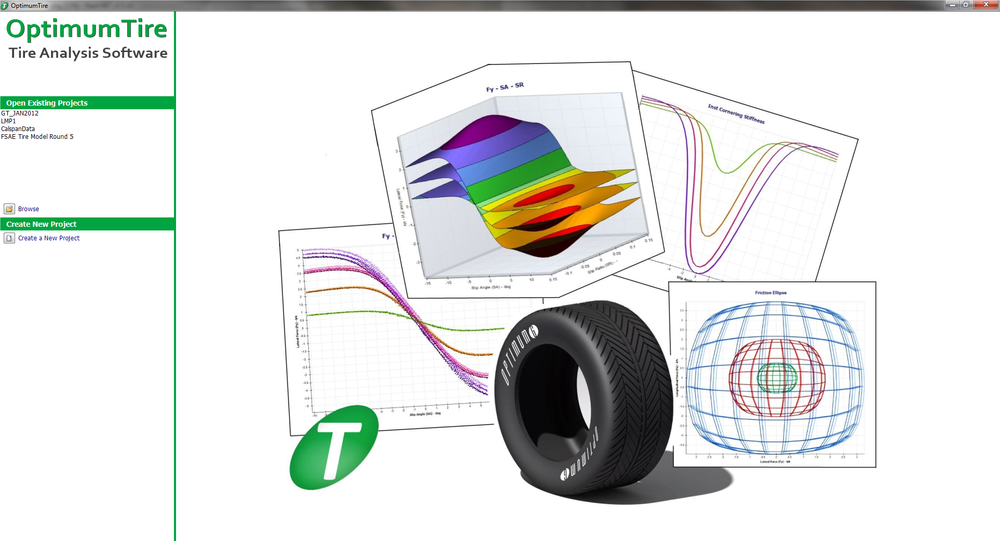
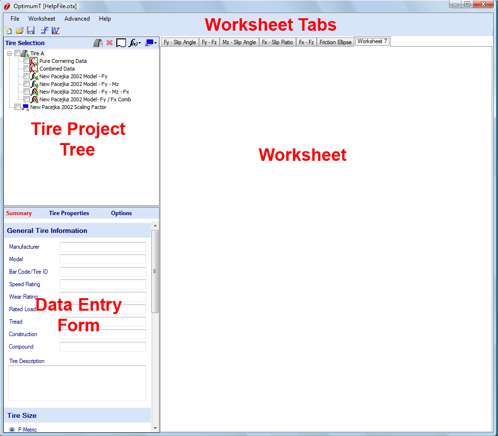

# Screen Layout

When OptimumTire is opened the project screen will initially appear. From this screen the user can either choose to open an existing project or create a new project. Once one of these is selected the primary OptimumTire screen layout will be displayed.

The OptimumTire screen layout is shown below. The screen is divided into three basic sections:

* The tire project tree
* The data entry form
* The worksheets and the associated worksheet tabs

