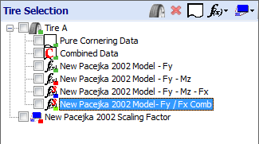
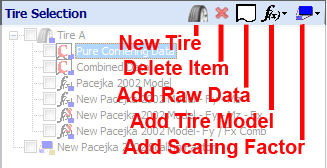

# Tire Project Tree

The tire project tree contains all the raw data, tire models, and scaling factors contained within the OptimumTire project. Raw data and tire models are organized by the tire item. The tire items can be seen more closely in the figure.

The item type in the project tree can be identified by the icon to the left of the item. In the figure, the first item in the list is a tire. The tire item is like a folder that contains other items in the project. Both raw data and tire models must be associated with a tire item, so this must be the first item added to a new project. This allows data and models from the same tire or construction to be grouped together.

## Raw Data

In the figure, the first two items in the project tree under Tire A are raw data. The icon for the second item, Combined Data, has a large red "C" in it to indicate that the collapsed data is being used. Data collapsing will be explained in the [Data Collapsing](../3_Raw_Tire_Data/D_Data_Collapsing.md) section.

## Tire Models

The third and fourth items in this project tree are tire models. The next two items are also tire models but the red "S" in the upper right corner of the icon indicates that a scaling factor has been applied to them.

## Scaling Factors

The final item is a Pacejka scaling factor. These allow the model to be adjusted without making any changes to the model coefficients. Scaling factors are discussed in more detail in the [Pacejka Scaling Factors](../9_References/I_Pacejka_Scaling_Factors.md) section.

Like the tire item when any of the raw data, tire models, or scaling factors is clicked additional information and functionality related to the selected item will appear in the data entry form. The small color squares in the lower right corner of the icons indicate the color in which the data or model will be displayed when it is graphed. To graph a specific tire model or raw data set, check the box next to the item in the project tree (check the [Graphing](../5_Graphing/5_Graphing.md) section). By right clicking on an item you can rename, delete, or copy it as well as perform other operations on it that will be discussed in later sections.

To add items to the project, the buttons above the project tree can be used. The figure below shows these buttons. The three buttons furthest to the right will only be enabled when an item in the project tree is selected.

