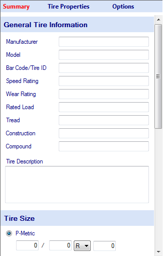

# Data Entry Form

When an item in the project tree is clicked on, a data entry form corresponding to the project item will appear in the data entry area. Note that the name of the project item or its icon must be clicked on. Clicking on the checkbox next to the item in the project tree will not bring up the data entry form but will change whether the item is to be graphed.

The figure below shows an example of the data entry form. This information appears when a tire item is selected in the project tree. Information about the tire size, manufacturing, and testing procedure can be stored here.

If the raw data, tire model, or scaling factor items are selected the information in the data entry area will change to reflect these items. The tire model coefficients are also contained in this form. If a graph is clicked on, the graph setup form for that specific graph will appear in the data entry area. The data entry forms will be discussed in more detail in the chapters corresponding to these specific items.
