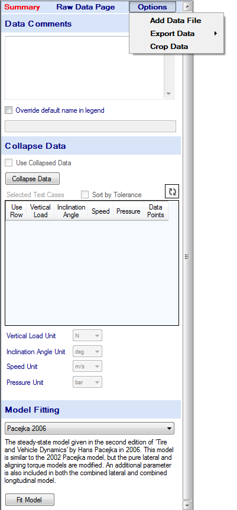

# Raw Tire Data

The raw data item in the project tree contains the imported data and provides some tools for manipulating the data. These tools allow the data to be quickly and conveniently viewed and fitted to tire models.

The raw data form, shown in the figure below, is displayed when a raw data item in the project tree is clicked on. This form has a place to store comments about the test data contained in the item. It also contains the __Data Cropping__ and __Data Collapsing__ tools. The __Data Cropping__ tool allows user to easily view and eradicate erroneous or undesired data from the raw data. The __Data Collapsing__ tool removes hysteresis from the data and separates the data into sets depending on the conditions that the tire was tested at. Once the data has been collapsed a summary of the separated data sets will appear in the table in the raw data from. The __Model Fitting__ tool in this section allows you to fit the raw or collapsed data to a tire model. Tire model fitting will be covered in more detail in the [Tire Models](../4_Tire_Models/4_Tire_Models.md).

The Options button at the top of the raw data form allows you to add another data file, export the tire data or access the __Data Cropping__ tool. A more detailed description of these operations is included in this section. The Data Comments allow the user to enter notes and information about the data. This information will be saved with the raw data in OptimumTire.
