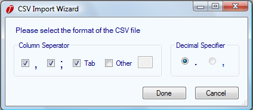
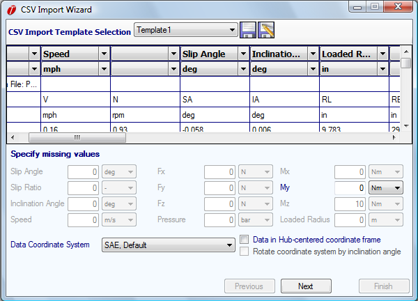
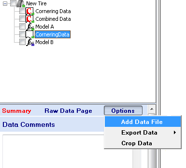

# Importing Data

When the __Add Raw Data__ button above the project tree is clicked on, an open file window will appear. OptimumTire can open either a .rtd file, which is the OptimumTire binary format for tire data, or a CSV or ASCII file with .csv or .dat file extensions. Files with no extension can be assumed to be CSV/ASCII files.

If a .rtd file is opened, the data will be automatically imported in the correct format and coordinate system. No further actions are required by the user.

If a CSV or ASCII file is selected a dialog box (__CSV Import Wizard__) as shown in the figure below will open. In this box the file properties can be specified. The character that separates the columns in the file and then the character that represents the decimal point should be selected. Multiple column separators can be selected if different file formats are to be used.

If a CSV or ASCII file is opened, the __CSV Import Wizard__, shown in the figure below, will appear. In this window the user specifies what quantity each column of raw data contains (i.e. SA, SR, Fx, etc) and the unit for that quantity. At the bottom of the dialog box, default values for quantities that are missing from the data can be specified. For example, if inflation pressure was not recorded in the test, the user could manually enter a constant inflation pressure to be included in the data. The coordinate system that the data was collected also needs to be specified.

This process can be automated by using the import template feature at the top of the __CSV Import Wizard__. The template to be used is chosen through the __CSV Import Template Selection__ dropdown box. It can be seen in the figure that currently Template 1 is selected. New import templates can easily be created and saved. First the data quantities, units, and coordinate system are specified. Then to save this as an import template, click the __Save as New Template__ button. Import templates can also be modified and saved by using the __Save Template__ button.

Typically tire data provides the force and moments at the center of the tire contact patch. However sometimes, especially with wheel force transducer data, it will be the force and moments at the wheel center. Therefore, the __Data in Hub-centered coordinate frame__ checkbox should be selected. Then OptimumTire will transform the force and moment data to the center of the contact patch. If this is the case the __Rotate coordinate system by inclination angle__ can also be selected. This should be done if the coordinate system that the force and moments were measured in are fixed to the wheel. In this case the vertical force would be in the same direction as the inclination angle and not perpendicular to the ground. Therefore, if this option is selected OptimumTire will transform the forces and moments to a ground fixed coordinate system.

Once all the column definitions have been assigned pressing the Next button will show a preview of the data to be imported. If the data to be imported is correct, clicking on __Finish__ will import the data into OptimumTire.

Generally different sets of raw data should be imported into OptimumTire as separate files. However multiple test files can be imported and combined in OptimumTire. This can be achieved in two ways. If the files are in the same format, simply select both files at the same time (use the shift or ctrl keys to choose more than one file). The import wizard will appear for the first file and the other files will be imported with the same settings.

If the files are in different format, multiple import into the same data item is done by importing the first data set as would normally be done. After this is completed, click on the data set in the project tree. Then select __Add Data__ in the __Options__ button in the upper right corner of the raw data form (see the figure below). This will open the same __CSV Import Wizard__ that was used previously. Follow the same steps as before and the data will be added to the previously imported set.

