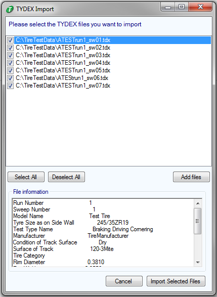

# Importing TYDEX Data

Tire data stored in the TYDEX file format can be imported into OptimumTire. The process will load any TYDEX files the user specifies and will convert these into the CSV/ASCII format which is the default OptimumTire tire data format.

Click the TYDEX button in the __Add Raw Data__ drop down menu to launch the TYDEX import wizard. In the window click __Add Files__ to add in all the TYDEX files which should be imported. The TYDEX import will combine all the TYDEX files into a single OptimumTire tire data object which can be used for model fitting. Generally, select all TYDEX files from a single test run (multiple sweeps) in the add file dialog.

Once the files have been added they can be selected or un-selected using the checkboxes in the file list window. Un-selected files will not be included in the import process. By clicking on one of the files in the list, additional information from the TYDEX file is the displayed in the textbox.

Clicking __Import Selected Files__ converts the TYDEX files into a single CSV/ASCII file and the __Add Raw Data__ import tool is automatically launched.