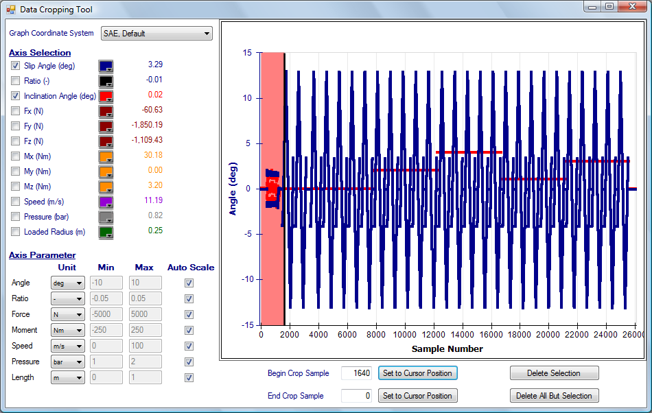
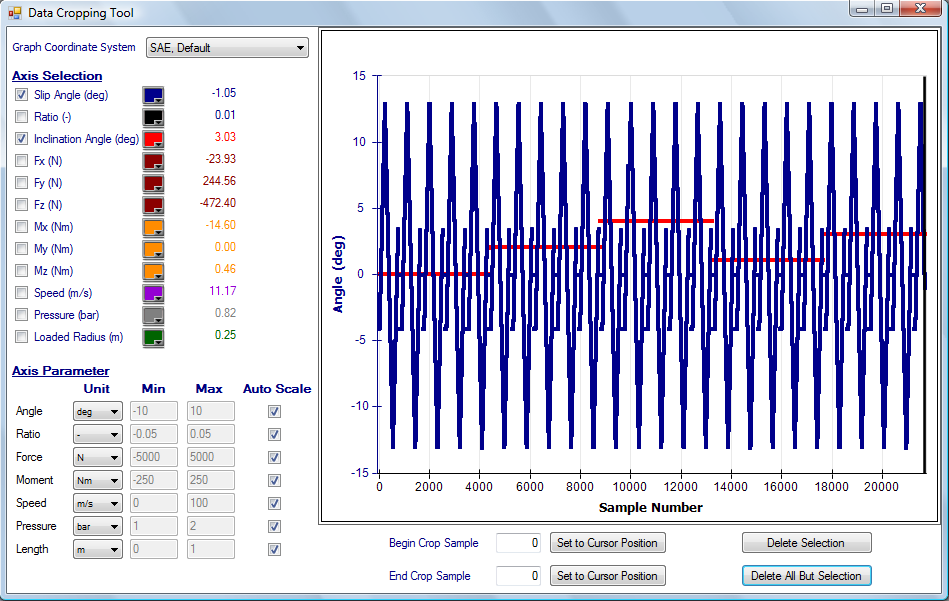

# Data Cropping

Data cropping allows the user to remove any unwanted or unnecessary data. Often in tire tests the data from conditioning or warm up procedures is included in the data file. This data can be easily removed in OptimumTire. The raw data can be cropped by selecting __Crop Data__ under the __Options__ button on the top of the raw data form. This will open the __Crop Data__ window as shown in the figure below. The raw data to be cropped is displayed in the graph. You can select what properties of the raw data are graphed by selecting the checkboxes on the left. In the figure slip angle is represented by the blue line and the inclination angle by the red line. By clicking on the boxes to the right of the properties the color of the property can be changed. The values to the right of this correspond to the data values at the location of the black line on the graph. At the bottom the units of the data and the axis ranges can be changed.

As can be seen at the beginning and end of the run extra data exists that is not necessary. The data to be removed can be selected by entering the beginning and ending sample numbers in the __Begin Crop Sample__ and __End Crop Sample__ textboxes at the bottom of the window. Alternatively, the vertical black line on the graph can be dragged to the point where the data should be cropped. Pressing the corresponding __Set__ button defines the beginning or ending sample number. The background of the selected data will be pink. Then the __Delete Selection__ or __Delete All But Selection__ buttons can be clicked to remove the selected data. The figure below displays the data from the figure above after it has been cropped. As can be seen only the relevant test data remains. When the Crop Data is closed the program will return to the primary OptimumTire screen with cropped data.

## Data Cropping Templates

To simplify the task of repetitively cropping data, templates can be set up. Crop templates record the beginning and ending sample number of each section deleted. The same actions can be applied to another data file. The file on which a template is used must be at least on long as the largest ending sample number in the template. A warning will be displayed if the crop template was created for a data file with a different number of samples than the one its being applied to.

To record a crop template, simply crop a data file as usual. Once this is done, click on the __Save As__ button next to __Crop Template__. Enter a name for the template and click on __Save__. To use a crop template, open the [Data Cropping Tool](#data-cropping) and choose the desired crop template from the __Crop Templates List__.
