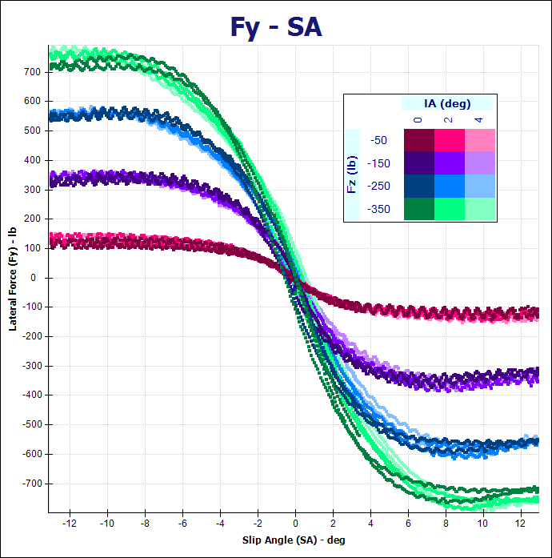
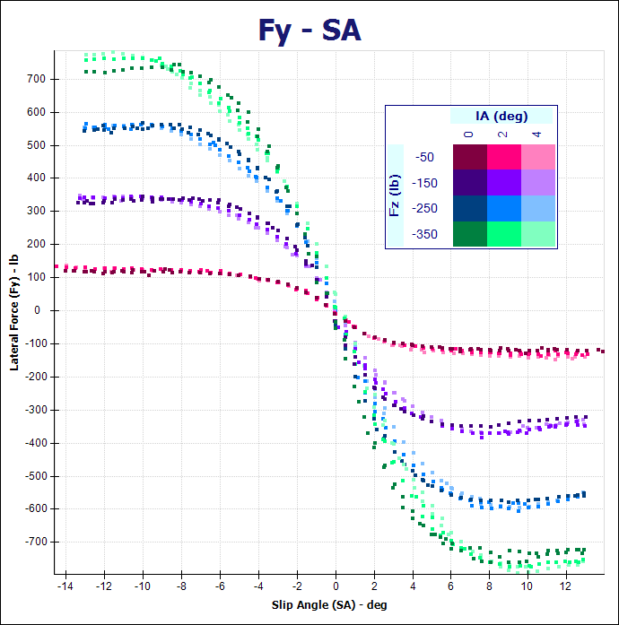
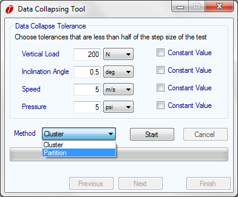
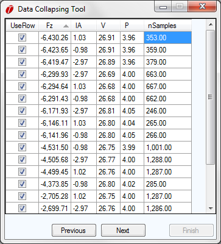
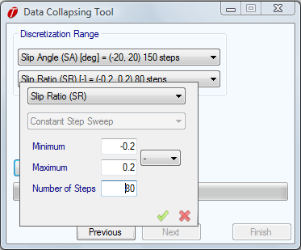
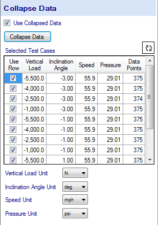

# Data Collapsing

The raw data is collapsed to remove hysteresis and variance from the test and make it easier to identify the tire test conditions. Collapsing the data allows tire models to be fit much more quickly. The following figures demonstrate this tool. The first figure shows an example of raw data before it is collapsed, while the second figure shows the same data, but collapsed. The data collapsing tool does not delete any data thus the original raw data is still available in OptimumTire. Therefore, if desired all the data can still be graphed or just the collapsed data.

Now the procedure for collapsing raw data will be described. First select the raw data to be collapsed from the project tree. Then in the data entry area click on the __Collapse Data__ button. This will open the data collapsing tool shown in the figure below.

First the data is sorted into different sets depending on the test conditions. In order to do this the data collapsing tolerances should be set at less than half of the step sizes used in the tire testing. For example, if a tire was tested at vertical loads of 100, 200, and 300 lbs the data tolerance should be set to at least less than 50 lbs. This will separate the different test conditions as well as sort out any irregular data. Select the constant value check box for test conditions that are kept constant throughout the test. This will increase the speed of the sorting.

There are two sorting methods available __cluster__ and __partition__. The cluster method works by creating several evenly spaced clusters and assigns each data point to the nearest cluster. The sizes of the initial clusters are determined by the variable tolerance. The algorithm then checks all the clusters. If the range of the cluster is too large the cluster is split if it is too small the cluster is deleted. The algorithm continues this process until all the clusters meet the size criteria. The partitioning method works by assigning each data point to its own cluster. The algorithm then checks the difference between adjacent clusters. If the clusters are too close, they are merged. The algorithm continues until the minimum distance between clusters has met the conditions defined by the variable tolerance.

Clicking on the __Start__ button will sort the data. Once this is completed click on the __Next__ button.

A list of the different sets of data will then be displayed. This is shown in the figure below. The rows of data can be sorted by value by clicking on the column headers.

It should be checked that these sets represent the data that you want to work with. Also, if the data at the very beginning or end of the test was not removed with the cropping tool it can be removed here. This data will normally be at significantly different speeds or vertical loads than the rest of the data. Also, if the data has a relatively low number of samples it most likely was not intended to be tested at those conditions. To remove sets of data just unselect the checkboxes next to that set. Once this is completed click on __Next__.

Then the discretization range over which the data will be collapsed must be selected. This is shown in the figure below. This determines the quantity and range of the collapsed data points that will be generated. Therefore, for pure cornering data the number of steps used for the slip angle should be higher than that for the slip ratio and vice versa for the combined lateral and longitudinal data. For combined data the number of steps used should be approximately equal.

Clicking on the __Collapse Data__ button will begin the collapsing process. This will compress each set of data points that fall within each discretization step. For each step, the subsequent data points are normalized with respect to their average vertical load. This is demonstrated in the following equations where $F_y$ is normalized with respect to the vertical load. A similar formulation is used to normalize the other output parameters (i.e. $F_x$, $M_z$, $M_x$, $M_y$, etc.).

$$F_y=\frac{F_z} {F_{z_0}} \times F_{y_0} \times α_0$$

With the normalized slip angle

$$α_0=\frac{F_{z_0}}{F_z} *α$$

Clicking on the __Finish__ button will close the __Data Collapsing Tool__ and return to the main OptimumTire window. A summary of the collapsed tire data will now appear in the data entry area when the tire data is selected in the project tree. The check-box labeled __Use Collapsed Data__ will automatically be checked after the data is collapsed. This checkbox specifies whether the original or collapsed data will be used for graphing and fitting of tire models. This can be seen in th figure below.

The summary of the collapsed data shown in the figure above allows the user to quickly see the data sets and the conditions of the test. The data can be sorted numerically by clicking on the column headers. The data can also be sorted by the tolerances by selecting the __Sort by Tolerance__ checkbox. The checkboxes in the first column allow the user to exclude or include certain data sets from graphing and tire model fitting. Since the original raw data is still stored in OptimumTire the same data can be collapsed multiple times.