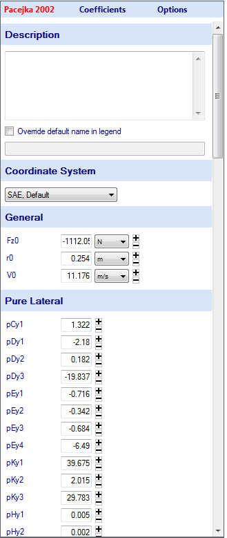

# Manually Input Model

If the tire model coefficients have already been determined, they can be manually inputted into OptimumTire. First select the __New Tire Model__ button at the top of the project tree. Then choose the type of tire model you would like to add to the project. The tire model will be added to the project tree. Right clicking on the tire model allows the user to rename, delete, or copy the model as well as many other functions. The model coefficients can now be put into the model input form, which appears in the data entry area when the model is clicked on. An example of this form is shown in figure below. For coefficients that have units the units can be specified in the dropdown boxes to the right of the value. The small plus and minus buttons also to the right of the values allow the user to adjust the model. This feature is covered in detail in the [Adjusting Models](../4_Tire_Models/F_Adjusting_Models.md) section.

