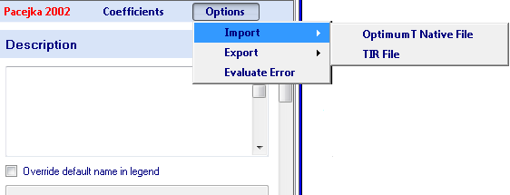

# Import and Export Models

Before a tire model is imported into OptimumTire the appropriate tire model needs to be added to the project. This is done by clicking on the __New Tire Model__ button at the top of the tire project tree. Once the tire model is added clicking on it will display its coefficients in the data entry area. Since it is a new model all the coefficients will be zero. At the top of the data entry area click on Options-Import as shown in the figure below. Tire model coefficients can then be imported from an OptimumTire Native file or from a TIR, or similar, file. Note that when you import a model, OptimumTire will overwrite the data contained in the model input form.

Tire models can also be exported from OptimumTire by clicking on the desired tire model in the project tree. Then, at the top of the data entry area, click on Options-Export and select the file format you prefer. You can export to OptimumTire Native files, Excel, Lookup tables and into text-based files, such as TIR files. You also have the option of copying the tire model to the clip board for use with the add-in (it will be in an encoded text format).

## Export Templates

When exporting to a text-based format, like a TIR file, OptimumTire uses export templates. You can edit the export templates in the template manager. When creating a new template, it is recommended that you start with an existing template and modify it. (If you start from a Predefined template, you will need to clone it first because these are read-only). When OptimumTire reads a template, it looks for parameter fields in the format __#PARAM#DEFAULT-VALUE#__. Note that there is a total of three # symbols for each parameter. __PARAM__ denotes the name of the parameter, __DEFAULT-VALUE__ denotes the default value for this parameter if it is not found in the tire model. If there are parameters specified in the export template that are not in the tire model, the user will be asked to specify them in a dialog when exporting a model. The default value will be used if the user does not specify a different value when exporting. The model description and coordinate system can be exported using the tags __#DESC#__ and __COORDSYS#__ respectively.

When exporting models using templates be aware that the simulation program you intend to use the model with may require the model in a specific coordinate system. Tir and similar files do not contain coordinate system information so the coordinate system must be modified within OptimumTire before exporting. In the case of the MF5.2 and P96 templates, which have been designed for use in RaceSim, you cannot export using the SAE coordinate system. It is recommended that you export using the Iso coordinate system for these models. 

OptimumTire also offers the ability to export lookup tables for simulation programs that do not directly import model coefficients or equations. For more details on how to use this feature of OptimumTire see the [Lookup Table Export](../7_Additional_Features/E_Lookup_Table_Export.md) section.

## Excel Export Templates

OptimumTire can also export to Microsoft Excel using export templates like those explained in the previous section 3.4. An Excel template is a regular Excel worksheet with cells that contain text that can be recognized by OptimumTire. When OptimumTire reads an Excel template it looks for parameter fields in the format #PARAM# where PARAM is the name of the coefficient to be exported, see pCy1 as shown in Figure 3.4. The model description and coordinate system can be exported using the tags #DESC# and #COORDSYS# respectively (Note OptimumTire will only search the first worksheet of an Excel template for the parameter fields). Once the template has been created the file should be copied and pasted into the application data folder using the template manager or saved in the application data folder:

Windows Windows 7, Windows 8, Windows 10:
C:\Users\UserName\AppData\Roaming\OptimumT\ExcelTemplates

