

# Fitting Models to Raw Data

Before fitting a tire model to the raw data, the data should be properly cropped and collapsed. This will make the fitting more accurate and significantly quicker. Also make sure that the __Use Collapsed Data__ option is selected for the tire data that will be used. This can be found at the top of the __Collapse Data__ section in the tire data input area. The following sections demonstrate how to fit a tire model. This example will use pure lateral and combined longitudinal and lateral data to create a complete tire model. Depending on the data available and the goal of the model fitting the order in which the models are fit can vary. More information about the order the models should be fit is included in the [Model Fitting Order](../4_Tire_Models/D_Model_Fitting_Order) section.

## Pure Lateral Model

Fitting of the cornering data to the model lateral force coefficients is generally done first. To begin select the tire data to be modeled in the project tree. Go to the last section of the data entry area, labeled Model Fitting. This is shown in the figure below.

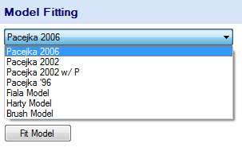

In the drop down select the type of tire model to be fitted. Once you have selected the type of model to be used click the Fit Model button. This will open the Model Fitting Tool as can be seen in the figure below.

### Specify the Coefficients to be Calculated

In the __Model Fitting Selection__ window, the coefficients to be fit are selected. The coefficients that the error calculation is based on are also selected by choosing the __Fit and Calculate Error__ option in the dropdown boxes. For this case you would select __Fit and Calculate Error__ in the drop down labeled __Fy Pure__ as is shown in the figure above. __Fit and Calculate Error__ must always be selected for at least one of the sets of coefficients. At the bottom of this window the coordinate system of the model can be selected. To proceed click the __Next__ button.

### Model Constraints

Now the model constraints must be set. The constraints required vary depending on what type of model is being fit. For the Pacejka models the constraints include the nominal (rated) tire load, $Fz_0$, the unloaded tire radius, $R_0$, the reference velocity, $V_0$, and the reference pressure, $P_0$. Typically, the nominal load is set to the largest or second largest load that the tire was tested at, the reference velocity is set to the test velocity, and the reference pressure is set to the highest inflation pressure the tire was tested at. More information regarding these parameters is included in the [References](../9_References/9_References.md).

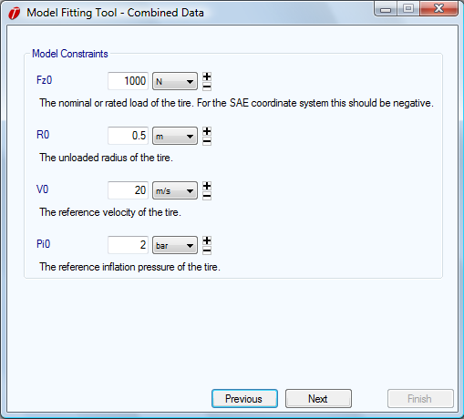

### Define the Coefficient Boundary

Now the Coefficient Boundary to be used in the fitting must be set. The coefficient boundary allows the solver to begin fitting the model in a restricted, more accurate range of values for the coefficients. However, the solver is not necessarily restricted to the range of coefficients set by the boundaries. In the figure below, the __Coefficient Boundary__ window is shown. A Coefficient Boundary is chosen by selecting it from the list. Click on __Next__ to proceed.

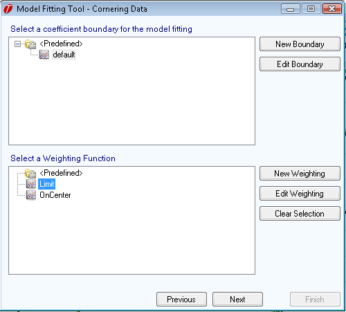

Coefficient boundaries can easily be created or edited by clicking on the __New Boundary__ and __Edit Boundary__ buttons to the right. However, the coefficients in the __Predefined Folder__ cannot be modified. If they are edited, the edited version will be saved outside of the __Predefined Folder__ and the original version will stay unchanged. When these buttons are clicked the __Coefficient Boundary Editor__ window will open as shown in the figure below. This window allows the boundaries for each coefficient to be changed. If the __Hard Boundary__ check boxes are selected the solver will be restricted to finding a solution within this range of coefficients. Save the new or edited boundary by typing in a name at the top of the window and clicking on save. Now you can close this window and the new boundary will be available for selection in the __Coefficient Boundary__ window.

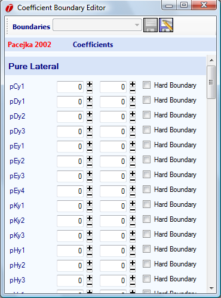

### Weighting Functions

Optionally, you can select a weighting function to apply to the fit. This will change the way the error is evaluated. For details about the error evaluation, please see [Solver Parameters and Evaluation](#solver-parameters-and-evaluation). You can select an existing weighting function by selecting it from the list in the coefficient boundary selection dialog (figure below). You can also create a new weighting function or edit an existing one in this dialog. If you have selected a weighting function and wish to remove this selection, click the __Clear Selection__ button.

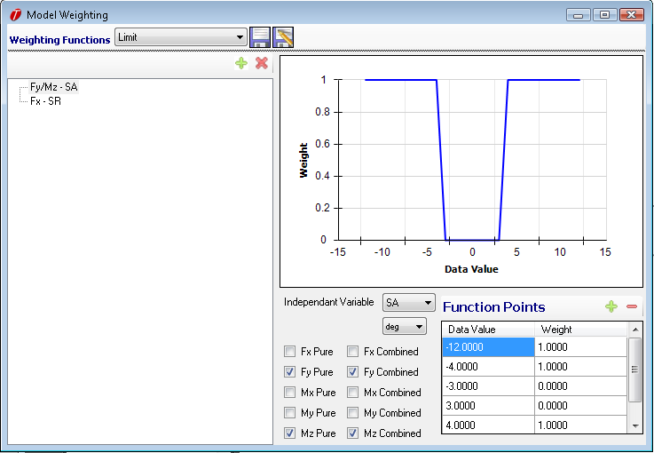

The figure above shows the weighting function editor. It is accessible by clicking either the __New Weighting__ or __Edit Weighting__ button. At the very top of the dialog, you can save or load a weighting function. On the left side, you can select the __Weighting Pages__ which define a part of a weighting function. There is no limit to the number of weighting pages that you can add (though there is a practical limit of 60, as it is not possible to define more than 60 non-redundant weighting pages). Each weighting page has one independent variable one or more dependent variables. If you want to make the solver treat the error of the FxPure fit with more "importance" at high slip ratios, you would define the independent variable to be slip ratio (SR) and the dependent variable to be FxPure. A given pair of independent and dependent variables cannot be defined twice within the same weighting function. You will receive an error if you try to do this.

Once the independent and dependent variables have been selected for a weighting page, the values of the weighting function can be entered. The function is defined as a table. OptimumTire will do a linear interpolation between the entries in the table. The Data Value column indicates the values of the independent variable, and the Weight column defines the weight. Typically, the values in the weight column will be between 0 and 1.

### Solver Parameters and Evaluation

Next the __Population and Iterations__ needs to be set. These parameters are used by the solver and are not related to the tire models. The Population is the number of initial vales that the solver will distribute between the coefficient boundaries. Therefore, if the coefficient boundaries are well defined the population can be less and vice versa. Iterations are the number of steps the solver will take when fitting the model. With a more complex model a larger number of iterations is required. The window that these parameters are set is shown in the figure below.

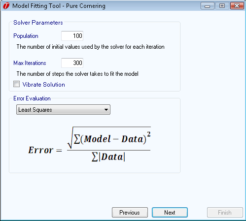

The __Vibrate Solution__ option will cause a small random variation to be applied to the data at each step. This can help the solver converge towards a global minimum slightly faster. Statistically, the variation is applied equally in both directions, so this technique does not bias the results.

The __Error Evaluation__ can now be selected. This determines what type of error criteria is used when fitting the model. The four types of error criteria included in OptimumTire are described below. In the equations, __Model__ represents the value found by the model fitter and Data represents the value of the actual raw data.

* Least Squares Error:

$$ Error=\frac{\sqrt{\sum\left(Model-Data\right)^2}}{\sum\left|Data\right|} $$

* Normalized Least Squares Error:

$$ Error=\frac{\sqrt{\sum\left(\frac{Model-Data}{Data}\right)^2}}{Amount Of Data Points} $$

* Total Error:

$$ Error=\frac{\sum\left|Model-Data\right|}{\sum\left|Data\right|} $$

* Normalized Total Error:

$$ Error= \frac{\sum\left|\frac{Model-Data}{Data}\right|}{Amount Of Data Points} $$

Typically, the __Least Squares Error__ criteria will result in the best overall model fit. However, depending on the variance and testing conditions of the raw data some of the other error criteria may produce a better fit. For example, when fitting an aligning torque model __Total Error__ will often produce slightly better results. The __Normalized Error__ criteria gives equal weight to all the data points. Therefore, it will improve the model fitting at lower loads.

In the case that a weighting function is used, the error evaluation is modified to be the following. The weighting is denoted as __ and is evaluated for each data point separately.

* Least Squares Error:

$$ Error=\frac{\sqrt{\sum w_i \left(Model-Data\right)^2}}{\sum\left|Data\right|} $$

* Normalized Least Squares Error:

$$ Error=\frac{\sqrt{\sum w_i \left(\frac{Model-Data}{Data}\right)^2}}{Amount Of Data Points} $$

* Total Error:

$$ Error=\frac{\sum w_i \left|Model-Data\right|}{\sum\left|Data\right|} $$

* Normalized Total Error:

$$ Error= \frac{\sum w_i \left|\frac{Model-Data}{Data}\right|}{Amount Of Data Points} $$

### Model Fitting

Now OptimumTire is ready to fit the tire model. However, if something is incorrect or the user would like to change some of the settings the Previous button can be used to go back to the previous windows. Alternatively, the __Model Fitting Tool__ window can be closed and the model fitting restarted.

Clicking on the __Summary__ button allows the user to check to make sure all the solver settings are correct. It will show the model being fit, the raw data to be used, the error calculation method, the coefficient boundary, and the solver parameters selected. To return to the __Model Fitting Tool__ window just close the model summary. Once the model fitting is finished this information will be automatically transferred into OptimumTire and will be stored with the associated tire model in the model’s data entry form.

Clicking on the __Start__ button in the upper right corner of the window will start the solver. The firgure below shows this window after a fitting has been completed. The graph shows the convergence of the solution and the textbox shows the current error as the model is fitted. When the final solution is found click on the __Finish__ button to return to the main screen of OptimumTire.

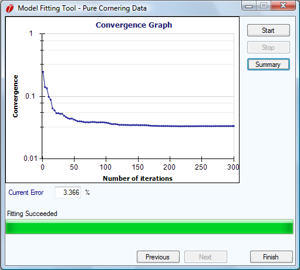

The newly created tire model should now appear in the project tree. This model can now be graphed by selecting the check box next to it (see the [Graphing](../5_Graphing/5_Graphing.md) section). It should be compared to the raw data to ensure accuracy. Lateral force as a function of the slip angle at the tested inclination angles should be graphed and compared to the raw data as shown in the Fy-SA graph below. Also, the lateral force as a function of the normal load, Fz, for several slip angles should be graphed as in the Fy-Fz graph (below the Fy-SA). The graphs should be checked for accuracy by comparing them with the raw data. The model should also be checked to ensure the curves are well behaved outside of the measurement area. This is especially important if the tire models are going to be used for simulation. Refer to [Adjusting Models](../4_Tire_Models/F_Adjusting_Models.md) for information on adjusting the tire model.

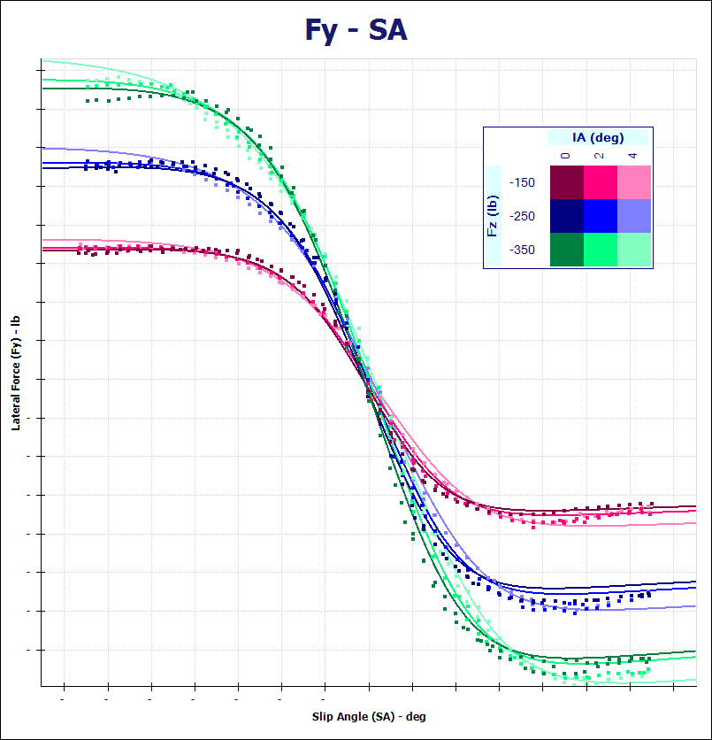

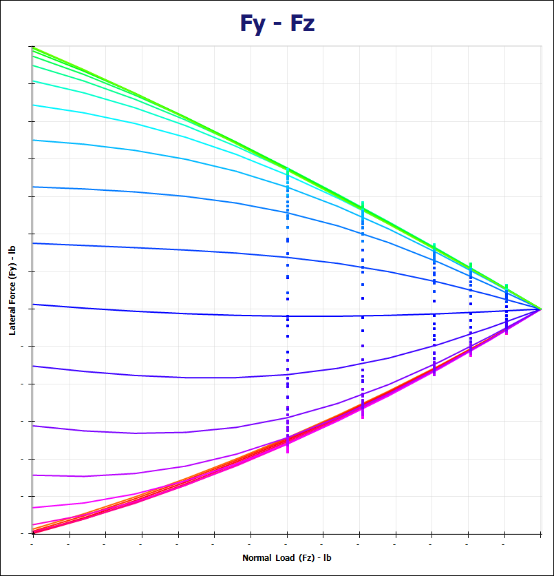

## Aligning Torque Model

Fitting the aligning torque model is very similar to the lateral force model. However, there are a few small differences since this model will be combined with the lateral force model. First select the tire data used to fit the lateral force model. In the __Model Fitting__ section select the same type of tire model as was used for the lateral force model and click on the __Fit Model__ button. This will open a different window than before since another tire model already exists in this project. The figure below shows the __Advanced Fitting Options__ window. In this window coefficients that were already determined in previously created models can be fixed for the current fitting. So, for this example you would set the Fy Pure category to the previously created tire model. In later sections you will see that you can set multiple sets of coefficients and also include model scaling factors. Once the correct coefficients are selected click on the __Done__ button.

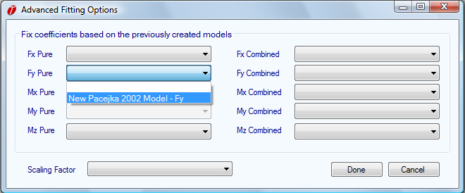

Now the __Model Fitting Selection__ window that was used to fit the previous models will open. For this case __Calculate and Fit Error__ in the drop down box labeled __Mz Pure__ would be selected. As can be seen in the figure below, the dropdown box corresponding to __Fy Pure__ is disabled because the coefficients for this model were fixed in the previous step. The rest of the tire model can now be created in the same way as the lateral force model. When finished a new tire model will be created that contains both the pure lateral force and the aligning torque coefficients.

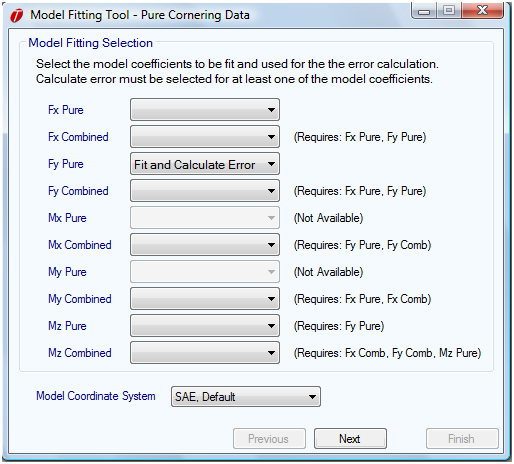

The aligning torque model could also have been created at the same time as the pure lateral force model, but for demonstration purposes was done separately. This would of have been achieved by selecting __Fit__ or __Fit and Calculate Error__ for both __Fy Pure__ and __Mz Pure__ when the coefficients to be fit were specified. The aligning torque as a function of the slip angle should be graphed with the tire data to check the accuracy of the model. An example of this is shown in the figure below.

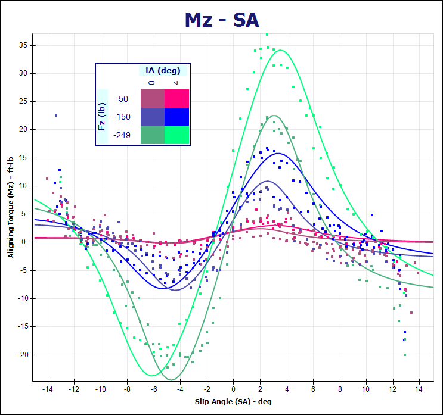

## Model Scalling Factors

In order to combine the data from a pure cornering test and a combined lateral and longitudinal test it will often be required to use a scaling factor. It will adjust the pure lateral force model created from the cornering data to match the combined lateral and longitudinal data at zero slip ratio.

The figure below shows the discrepancy between the lateral force model and the combined data for the same tire. The pure lateral force model is represented by the solid lines and the combined data is the clusters of points at approximately 0, 3, and 6 degrees of slip angle.
These points represent the force at zero slip ratio. This discrepancy is an effect of the pure cornering test being performed at a constant slip ratio and varying slip angle, while the combined test is performed at a constant slip angle with a varying slip ratio. These tests are
also often performed at different speeds. Additionally, the tire will experience different heat
cycling in these tests and therefore different results would be produced.

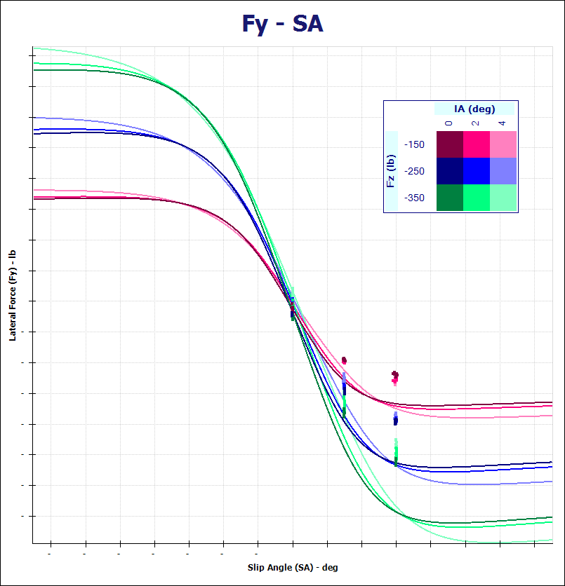

Therefore, to remedy this problem a scaling factor will be created and applied to the previously created models. To create a scaling factor, click on the __New Scaling Factor__ button in the upper right corner of the project tree area. The figure below shows this button, circled in red. Scaling factors can only be created for the Pacejka models. Similarly to the tire data and models, the scaling factor can be deleted, copied, or renamed by right clicking on it in the project tree.

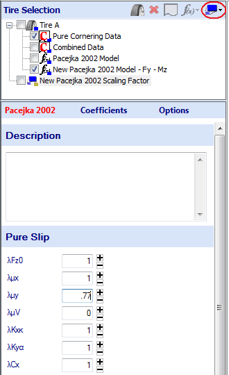

In the figure above, a previously added scaling factor can be seen in the project tree. The scaling factor can be applied to a tire model by dragging and dropping it onto the tire model or by right clicking on the tire model and choosing __Add Scaling Factor__. The small red "S" that appears on the selected tire model indicates that a scaling factor has been applied to the model. The scaling factor applied to a tire model can be removed or viewed by right clicking on the tire model.

When a scaling factor is selected in the project tree its coefficients will appear in the data entry area as can also be seen in the previous figure. A description of these coefficients appears in the [Pacejka Scaling Factors](../9_References/I_Pacejka_Scaling_Factors.md) section. The coefficients can be modified manually or by double clicking on the "+" or "-". This will increase or decrease the value of the scaling factor by 10%. If the scaling factor is applied to a graphed model holding down on these buttons will show a preview of the change (For more information on adjusting models refer to [Adjusting Models](../4_Tire_Models/F_Adjusting_Models)). Decreasing the peak lateral friction coefficient, $\mu_y$, will decrease the lateral force of the model. The figure below shows the lateral force of the model and data previously shown.

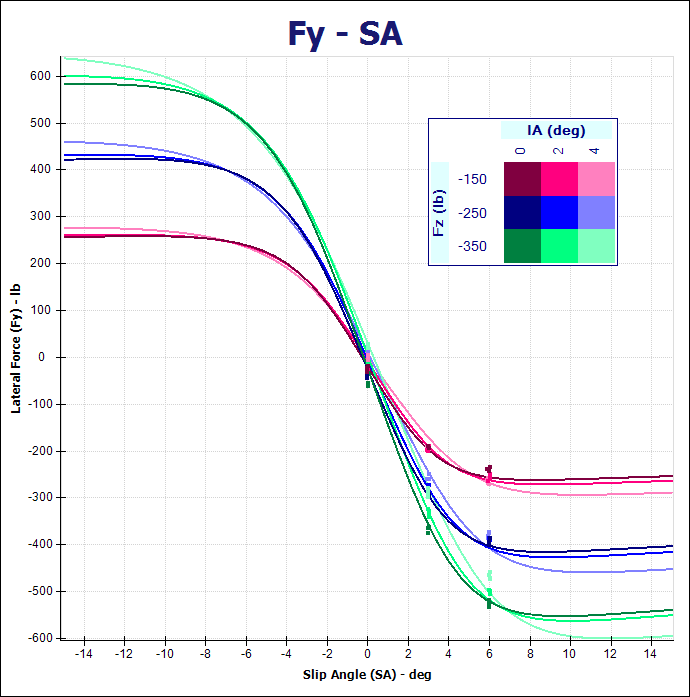

Scaling factors are also commonly used to adjust tire models to more accurately represent the actual vehicle performance. This is necessary because the conditions and surfaces the tires are tested on are typically different than those they are to be used on. For more information regarding the scaling coefficients and their effect on the models please refer to the [Pacejka Scaling Factors](../9_References/I_Pacejka_Scaling_Factors.md) section.

## Pure and Combined Longitudinal Model

Now that the previously created model is properly scaled a pure longitudinal and combined longitudinal model can be created. This process will be similar to the previous models but both models will be created simultaneously. They will be created at the same time because the combined lateral and longitudinal tire data are collected at various slip angles. Thus the tire data is representative of pure and combined longitudinal force.

First, the combined data to be used should be imported and properly collapsed (These operations are covered in [Raw Tire Data](../3_Raw_Tire_Data/3_Raw_Tire_Data.md)). Then select the combined lateral and longitudinal tire data in the project tree. In the __Model Fitting__ section select the appropriate tire model and click on the __Fit Model__ button. This will open the __Advanced Fitting Options__ Window. Set the dropdown boxes corresponding to __Fy Pure__ and __Mz Pure__ to the appropriate tire model to fix these coefficients. Click __Done__ once this is completed.

The __Model Fitting Selection__ window will now open. For this case you would select __Fit__ in the __Fx Pure__ drop-down box and __Fit and Calculate Error__ in the __Fx Combined__ drop down box as shown in the figure below. You can also calculate the combined error for both models by selecting __Fit and Calculate Error__ for both models. __Fit and Calculate Error__ must be selected for at least one of the models. The rest of the tire model can now be created in the same way as the lateral force model. When finished a new tire model will be created that contains both the pure and combined longitudinal force coefficients.

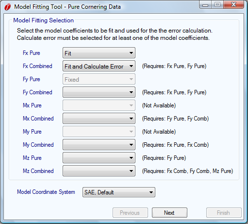

This model should be checked by graphing the longitudinal force as a function of the slip ratio and as a function of the normal load, Fz. Examples of these graphs are shown in the figures below. You should check that the model curves correlate well to the tire data and are well behaved outside of the measurement  area especially if the tire model is going to be used for simulation. If the models need to be adjusted please refer to the [Adjusting Models](../4_Tire_Models/F_Adjusting_Models.md) section.

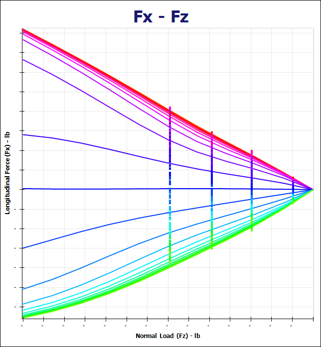

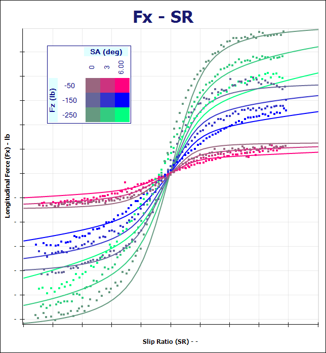

## Combined Lateral Model

The combined lateral model is also fit from the combined lateral and longitudinal data. The procedure is very similar to the other models except that the scaling factor should be applied when the model is fit. This is the case because the model will be based on the unscaled Fy Pure coefficients. This is done by selecting the appropriate scaling factor in the __Advanced Fitting Options__ as is shown in the figure below. As can also be seen in the figure, all of the previously determined coefficients are set to the appropriate tire model.

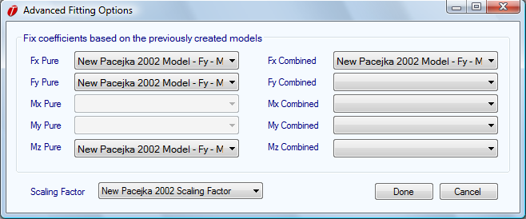

A friction ellipse can now be plotted to ensure the accuracy of the combined lateral and longitudinal models. A graph of a friction ellipse is shown in the figure below. If these models are to be used for simulation it is very important to check that the model curves are well
behaved outside of the measurement area.

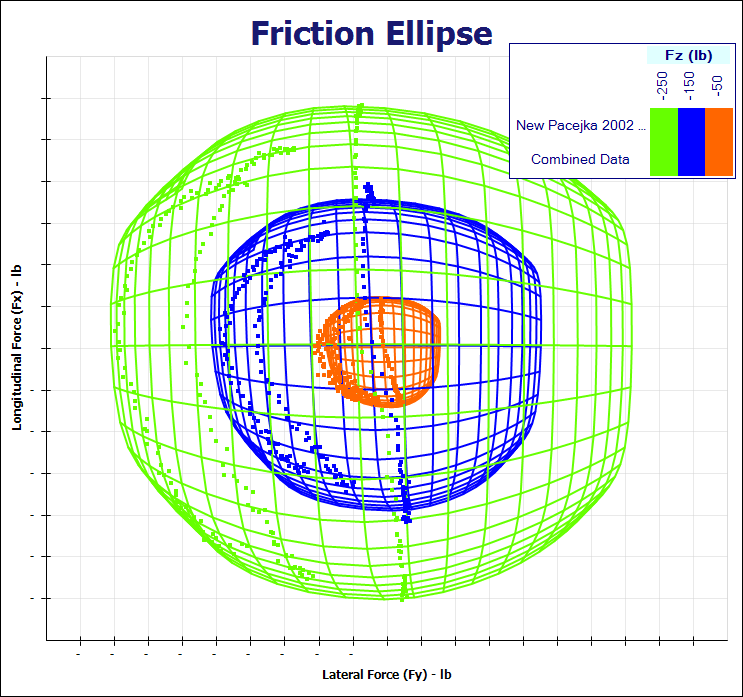

## Additional Models

Additional tire properties can also be fitted to the Pacejka models. These include combined models of aligning torque, rolling resistance, and overturning moment. The table below summarizes all of the models that can be fit to Pacejka coefficients in OptimumTire. It also shows what models are required before creating a new model. The required models can either be fixed prior to or fit concurrently with the new model. These models are fit in the same way as the previous example.

|Model|Requires|
|:---|:---|
|Fx Pure (Longitudinal Force)||
|Fx Comb (Combined Longitudinal Force)|Fx Pure and Fy Pure|
|Fy Pure (Lateral Force)||
|Fy Comb (Combined Lateral Force)|Fx Pure and Fy Pure|
|Mx Pure (Overturning Moment)||
|Mx Comb (Combined Overturning Moment)|Fx Pure and Fy Pure|
|My Pure (Rolling Resistance)||
|My Comb (Combined Rolling Resistance)|Fy Pure and Fy Comb|
|Mx Pure (Aligning Torque)|Fy Pure|
|Mx Comb (Combined Aligning Torque)|Fx Comb, Fy Comb and Mz Pure|

The table above displays the separate sets of coefficients that are available in the Pacejka models. Only combined, pure, rolling resistance and overturning models can be fit with the Pacejka models. The overturning moment and rolling resistance models are not available in the Pacejka ’96 model.
