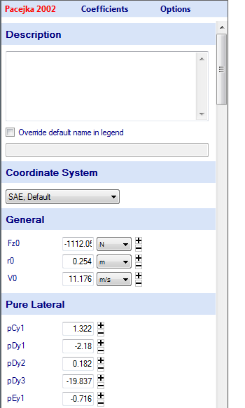

# Model Coefficient Form

After a model is fit the coefficients corresponding to it can be accessed by clicking on the model in the tire project tree. This will display the __Model Coefficient Form__ in the data entry area, as shown in the figure below. This form includes the model coefficients, a description box, and the option to change the name displayed in the legend for the model. In this form, the model coefficients can be modified by the user. This will be covered in detail in the next section.

After a model is fit, information regarding the model fitting will be directly imported into the description box, as can be seen in the figure above. The information included in the description box is the final error of the fitting, the model that was fit, the data file used, the fitted coefficients, the error evaluation method, the coefficient boundary, and the solver parameters.
