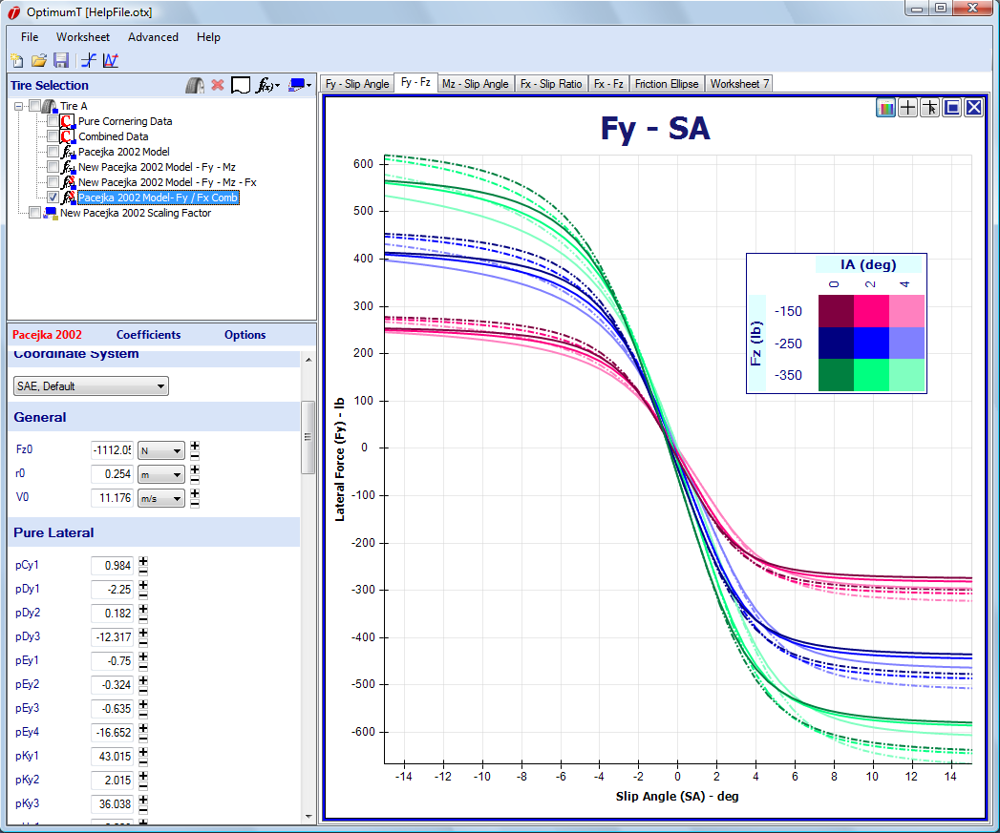

# Adjusting the Model

Once the model is created and graphed against the raw data you might want to adjust it to improve its accuracy in a certain region or improve its behavior beyond the measurement area. This can be done easily in OptimumTire.

Selecting a tire model in the project tree will show the model coefficients in the data entry area. You can modify the coefficients by 10% by double clicking on the "+" or "-" button next to the coefficient. If the model is shown on a graph (see the [Graphing](../5_Graphing/5_Graphing.md) section for information about how to make graphs), holding down the __+__ or __-__ button will show a preview of the model with the coefficient modified by 10%, i.e., when clicking the "+" and "-" button, the coefficient is either multiplied or divided 1.10. An example of this is shown in the figue below. In this figure the __+__ button of the __pDy1__ coefficient is being held own. As can be seen, this change has a large effect on the graph. Changing other coefficients will have a much different effect on the curve both in terms of its magnitude and shape. The coefficients can also be adjusted manually by changing the values in the boxes. When applied to a tire model the coefficients of a scaling factor can be adjusted in the same way.

