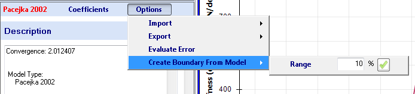
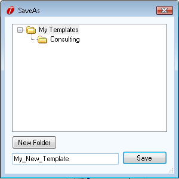

# Creatig Coefficient Boundaries From an Existing Model

You can create a boundary from an existing model. When doing this, you specify the half-width of the boundary. In the model coefficient form, click on __Options__ then __Create Boundary From Model__ to arrive at the range specification (shown in the figure below). Enter the desired range and click the check-mark button. The minimum for each coefficient is created by reducing the the coefficient value by the user specified percentage, and the maximum is created by increasing the the value by the same amount. For example, if one of the coefficients of the model has a value or 1.00 and you specify a boundary range of 10%, the minimum will be 0.90 and the maximum will be 1.10.

Once you have clicked the check-mark button to create the boundary, you will be presented with the dialog shown in in the figure below. Enter the name to save the boundary as and choose a folder to put the boundary in.

