

# Standard Graphs

Standard graphs can display raw data and tire models. The data or model to be graphed can be specified by selecting the checkbox next to the desired items in the project tree. A new standard graph can be added to a worksheet in multiple ways. Right-clicking on the worksheet or worksheet tabs and selecting __Add Graph__, selecting __Add Graph To Worksheet__ from the __Worksheet Menu__ on the __Main__ toolbar or by clicking on the __Add Graph__ button in the toolbar next to the __Save__ button. Up to four graphs can be placed on a single worksheet. When a graph is added to the worksheet the graph setup form will appear in the data entry area. To show the graph setup form when the data entry area is showing another form, click on the graph. You must specify six graph inputs and two or three graph outputs to create a graph. These will be further discussed in the following sections.

## Types of Standard Graphs

There are three types of standard graphs. Single direction line graphs, crossed line graphs and surface graphs. You can select the type of graph by choosing the appropriate option in the list of radio buttons near the bottom of the data entry form.

### Single Direction Line Graphs

An example of a single direction line graph is shown in the figure below. When plotting models using this type of graph, lines are generated based on the first of the graph inputs. For example, if the first graph input (labeled as __Indep. Variable__) is slip angle, lines will be generated by varying the slip angle while keeping all the other graph inputs constant.

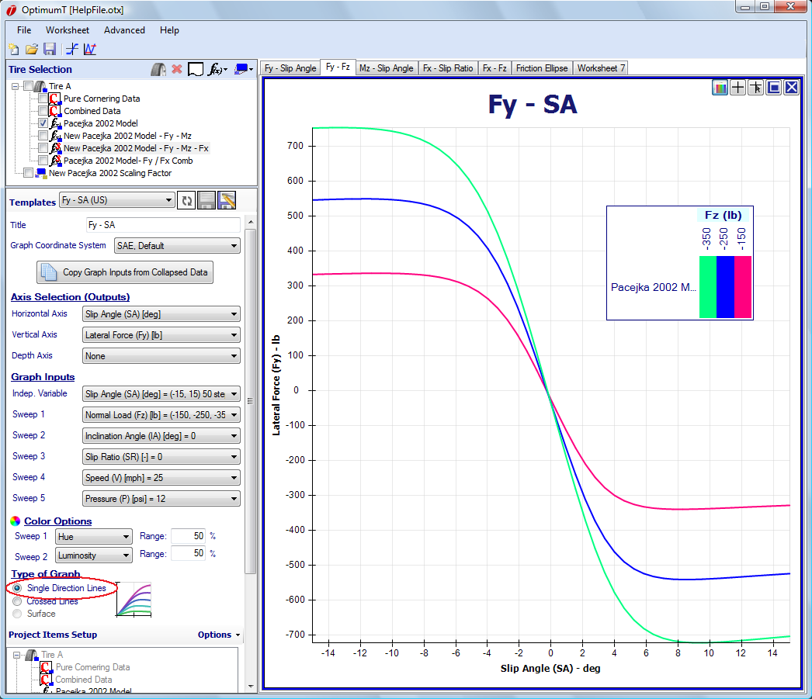

### Crossed Line Graphs

An example of a crossed line graph is shown in the figure below. As can be seen in the figure there are two independent variables for this type of graph. Therefore, two sets of lines will be generated for this graph. The first set of lines is generated by varying the first graph input while holding all others constant. The second set of lines is generated by varying the second graph input while holding all the others constant. For example, if the first graph input (labeled __First Indep.__) is set as slip angle and the second input (labeled __Second Indep.__) is set as slip ratio, then one set of lines will be generated with constant slip ratio and varying slip angle and another set of lines will be generated with constant slip angle and varying slip ratio. This type of graph is useful when creating a friction ellipse where you want lines of constant slip angle and lines of constant slip ratio.

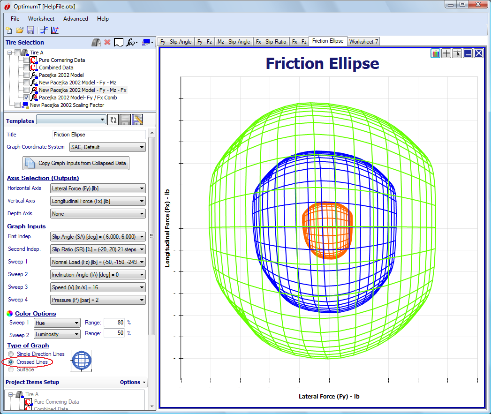

### Surface Graphs

An example of a surface graph is shown in the figure below. Surface graphs are only available when a third graph output is selected in the Depth Axis drop down box. Surfaces are generated in the same way that crossed line plots are generated, but the area between the lines is filled to generate the surface.

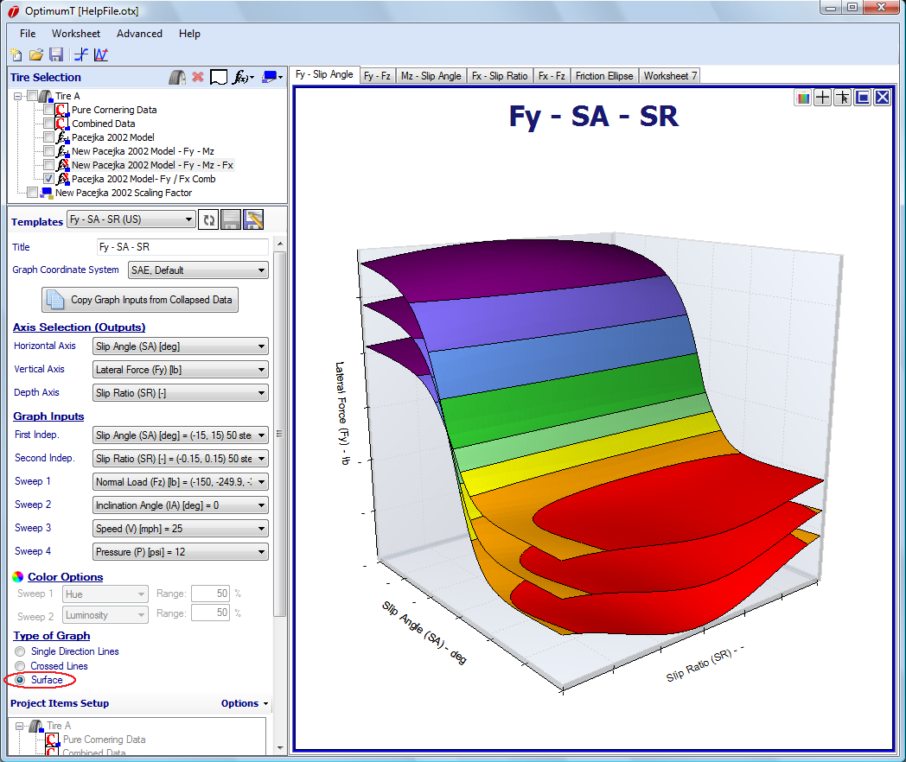

## Setting Up a Standard Graph

For OptimumTire to generate a graph all six possible steady state tire conditions must be
specified. These graph inputs are:

* Slip angle, $\alpha$
* Slip ratio, $\kappa$
* Normal load, $F_z$
* Inclination angle, $\gamma$ 
* Velocity, $V$
* Inflation pressure, $P$

In addition to the six graph inputs, the two graph outputs, the __Horizontal Axis__ and __Vertical Axis__ must be set to create a graph. If you are making a 3D graph a third output, the __Depth Axis__, must also be specified. Essentially, the OptimumTire plotting tool is evaluating a tire model or searching through the tire data for the three axes as follows:

$$X = f_1(\alpha, \kappa, F_z, \gamma, V, P)$$
$$Y = f_2(\alpha, \kappa, F_z, \gamma, V, P)$$
$$Z = f_3(\alpha, \kappa, F_z, \gamma, V, P)$$

## Graphs Outputs

The graph outputs specify what quantity and data range that each graph axis should represent. The graph output dialog is shown in the figure below. In this dialog the graph output to be used for each axis can be chosen. The unit displayed and the axis scaling can also be chosen. If the __Auto Scale__ check box is selected, the scaling will adjust according to the data shown on the graph. The __Auto Scale__ is unchecked then minimum and maximum value for the axis can be entered. Selecting __Hide Axis Values__ will remove the numeric values from the graph axis.

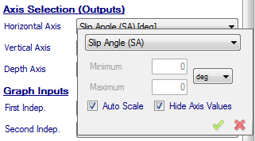

Currently, OptimumTire includes over 30 outputs that can be graphed. These outputs as well as their associated unit types are shown in the tables below. The unit types are displayed because OptimumTire allows the user to select between many different units. For more information about the available units in OptimumTire please refer to the [Units](../9_References/C_Units.md) section.

|Basic|Unit Type|
|:---:|:---:|
|Inclination Angle (IA)| angle |
|Slip Angle (SA)| angle |
|Slip Ratio (SR)| ratio |
|Speed (V)| velocity |
|Pressure (P)| pressure |
|Loaded Radius (RL)| length |

|Force/Moment|Unit Type|
|:---:|:---:|
|Longitudinal Force (Fx)|force|
|Lateral Force (Fy)|force|
|Vertical Force (Fz)|force|
|Overturning Moment (Mx)|moment|
|Rolling Resistance (My)|moment|
|Aligning Torque (Mz)|moment|

|Derivatives|Unit Type|
|:---:|:---:|
|Cornering Stiffness|force / angle|
|Inst. Cornering Stiffness|force / ratio|
|Slip Stiffness|force / angle|
|Inst. Slip Stiffness|force / ratio|
|Camber Stiffness|force / angle|
|Inst. Camber Stiffness|force / angle|
|Lateral Load Sensitivity|ratio|
|Longitudinal Load Sensitivity|ratio|
|Aligning Moment Load Sensitivity|length|
|Overturning Moment Load Sensitivity|length|
|Rolling Resistance Load Sensitivity|length|

|Normalized|Unit Type|
|:---:|:---:|
|Normalized Longitudinal Force|ratio|
|Normalized Lateral Force|ratio|
|Normalized Inst. Cornering Stiffness|1 / angle|
|Normalized Inst. Slip Stiffness|ratio|
|Normalized Inst. Camber Stiffness|1 / angle|
|Cornering Stiffness Coefficient|1 / angle|
|Slip Stiffness Coefficient|ratio|
|Camber Stiffness Coefficient|1 / angle|

|Coefficient of Friction|Unit Type|
|:---:|:---:|
|Lateral Coefficient of Friction|ratio|
|Longitudinal Coefficient of Friction|ratio|

|Moment Arm|Unit Type|
|:---:|:---:|
|Pneumatic Trail|length|
|Pneumatic Scrub Radius|length|

|Peak|Unit Type|
|:---:|:---:|
|Slip Angle at Peak Fy (negative)|angle|
|Slip Angle at Peak Fy (positive)|angle|
|Slip Ratio at Peak Fx (negative)|ratio|
|Slip Ratio at Peak Fx (positive)|ratio|
|Peak Lateral Force (negative)|force|
|Peak Lateral Force (positive)|force|
|Peak Longitudinal Force (negative)|force|
|Peak Longitudinal Force (positive)|force|

|Offset|Unit Type|
|:---:|:---:|
|Fx Offset (Fx @ SR = 0|force|
|Fy Offset (Fy @ SA = 0|force|

## Graph Inputs

The graph inputs can be fixed values, constant sweeps or custom sweeps. The graph inputs are specified by clicking on the box next to one of the six graph inputs. A dialog box similar to that shown in the figure below will appear. The first item to be chosen is the variable for the graph input. This is chosen in the first dropdown box of the dialog. As can be seen in the figure, __Slip Angle__ is currently selected as the first independent. As previously mentioned, all six inputs must be present.

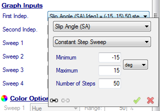

For a Single Line graph the first graph input, labeled Indep. Variable, will be the quantity used to generate the graph lines. For a Crossed Line or Surface graph the first two graph inputs, labeled First Indep. and Second Indep., will be the quantities used to generate the graph lines. The rest of the graph inputs, labeled Sweep, allow the plotting of multiple lines depending on the other tire conditions. For the first two of these, the option of changing the color of the graphed lines according to these inputs is available (see section 4.1.8 for more
information).

The second dropdown box in this dialog allows the user to specify the type of sweep to be graphed. For each input in the graph input dialog three different types of sweeps can be chosen. The three sweep types available are: Fixed Value, Constant Step Sweep, and Custom Sweep. For the independent variables either the Constant Step Sweep or Custom Sweep should be used. For the sweep variables any of the sweep types can be used.

### Fixed Value Graph Inputs

As the name suggests, fixed value graph inputs hold a particular variable constant when generating the graph. In the example shown in the figure below, __Fixed__ is selected in the second drop down box. Therefore, the inclination angle is being held at a constant 2 degrees. In the fixed value dialog, there is also a box for data tolerance. This value tells OptimumTire what tolerance to use when searching raw data. Since there will always be some noise in the raw data, OptimumTire needs to know how far from the nominal value it should consider to be "close enough" to include in the plot.

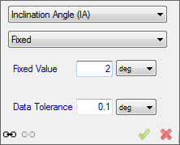

### Constant Sweep Graph Inputs

Constant step sweep graph inputs generate a set of evenly spaced points between a minimum and a maximum value. The constant sweep dialog is shown in the figure below. A minimum and a maximum value for the sweep as well as the number of steps needs to be entered into the dialog. Constant sweep graph inputs do not have data tolerances as fixed graph inputs do. All data that falls within the specified range is used.

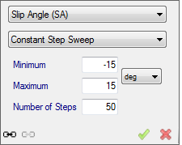

### Custom Sweep Graph Inputs

A custom sweep graph input allows you to specify a number of arbitrary values. The figure below shows the custom sweep dialog. You can specify any number of values by typing them into the table. Additional rows can be added by clicking on the green __+__ and rows can be removed by clicking on the red __-__ above the input list. Like the fixed value graph input, custom sweep graph inputs have data tolerances.

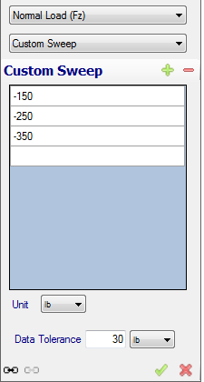

## Plotting Raw Data

Initially when raw data is imported and graphed in OptimumTire all of the data will be plotted regardless of the graph input parameters. This __Plot all Data__ feature allows the user to quickly view data to ensure that it is the correct data and that it was imported successfully. If the user would like to graph data at certain conditions specified by the graph inputs, this feature needs to be unselected.

When the __Plot all Data__ option is unselected, OptimumTire will search for raw data points that correspond to all six of the graph inputs. Points matching the six conditions will be plotted on the graph.

There are three different ways to unselect the __Plot All Data__. The first one is by right clicking on the raw data in the project tree and selecting __Remove "Plot All Data" In All Graphs__. This is shown in the figure below. This will disable the feature for the selected data set in all of the graphs.

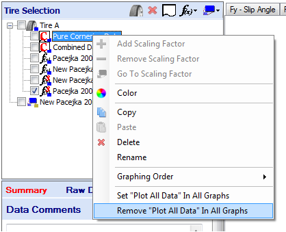

The other two procedures to unselect this option are located in the __Project Items Setup__ at the bottom of the graph setup form as shown in the figure below. Since this is located in the graph setup form it will only affect the graph that it corresponds to. As can be seen "all data" will appear to the right of the name of the data if __Plot All Data__ is enabled. By right clicking on the data and clicking on the __Plot All Data__ selects or unselects this feature. The __Options__ button in the upper right of the figure allows the user to set all or no items to __Plot All Data__. Again this will change all of the items for the current graph only.

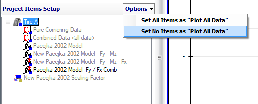

## Copy Graphs Inputs from Collapsed Data

The __Copy Inputs from Collapsed Data__ button located on the graph setup form is shown in the figure below. This feature allows the user to quickly set the graph inputs. It will copy the values and tolerances set in the data collapsing into the graph setup inputs. Therefore to use this feature the current project must contain collapsed data.

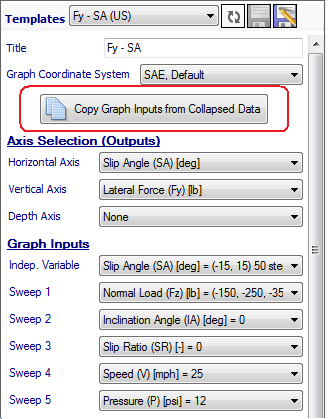

When this button is clicked a window similar to the one shown in the figure below will appear. This window displays all of the collapsed data in the project. Selecting one of the data sets and pressing the __Copy__ button will import the collapsed data values and tolerances into the graph setup form, therefore instantly plotting the data at all of its tested conditions.

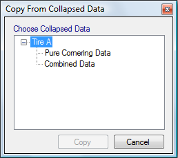

## Linking Graphs

The data input in different graphs can be linked together. Thus when the linked input in one of the graphs is changed it will be applied to the other graphs that are linked to it. The inputs are linked by clicking on the __Link Sweep__ button. This button as well as the __Unlink Sweep__ button is circled in the figure below. After clicking on this button a message box that says Please select a graph will appear. Clicking on any of the other graphs will link them to the original graph. The linked input of the original graph will now change to reflect the input of the selected graph. If you would like to link another graph to these two, click the __Link Sweep__ button on that graph and then choose one of the previously linked graphs. Multiple graphs and inputs can be linked together in the same fashion.

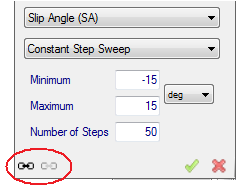

## Coloring Graphs

The color of the graphs is based on the color assigned to the project item. This can be changed by right-clicking on the item in the project tree and selecting color. Then a window will open were the user can choose the base color to be used. This will change the color of the item in all of the graphs. The color of all of the items in one tire can also be changed. This is done by right clicking on the tire itself and selecting color. The color in the bottom right corner of the item icon displays the current base color of that item.

The base color of an item can also be changed in each graph separately. This can be done in the __Project Items Setup__ at the bottom of the graph setup form. By right clicking on an item in this list the user is given the option to __Set Custom Color__ or __Return to Default Color__. Selecting __Set Custom Color__ will allow the user to change the base color of this item in only the current graph. Selecting __Return to Default Color__ will change the color to the color of the same item in the project tree.

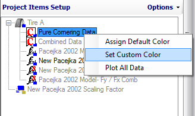

If you choose, you can also alter the color of the graph based on two of the graph inputs. This will modify the base color depending on the first two input sweeps of the graph. The color of the data sweeps can be altered in the bottom of the graph input form as seen in the figure below. The color is altered according to the color quantity selected. These include __Constant Color__, __Hue__, __Luminosity__, or __Saturation__.

__Hue__ will change the actual color of the lines according to the input sweeps as shown in the figure below.

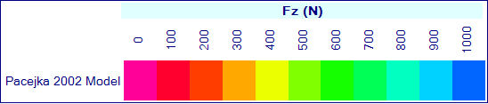

__Luminosity__ will affect the visibility of the lines as shown in the figure below.

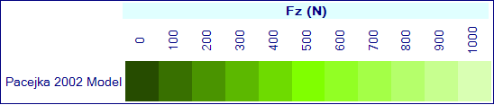

__Saturation__ will affect the brightness of the lines as shown in the figure below.

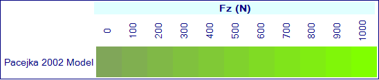

In the figure below, __Hue__ is varied with the vertical load and the __Luminosity__ is varied with the inclination angle. The range for these quantities in percentage can be entered in the textboxes to the right. A higher range will create a larger difference in color between the lines. Custom coloring is not currently available for the surface graphs.

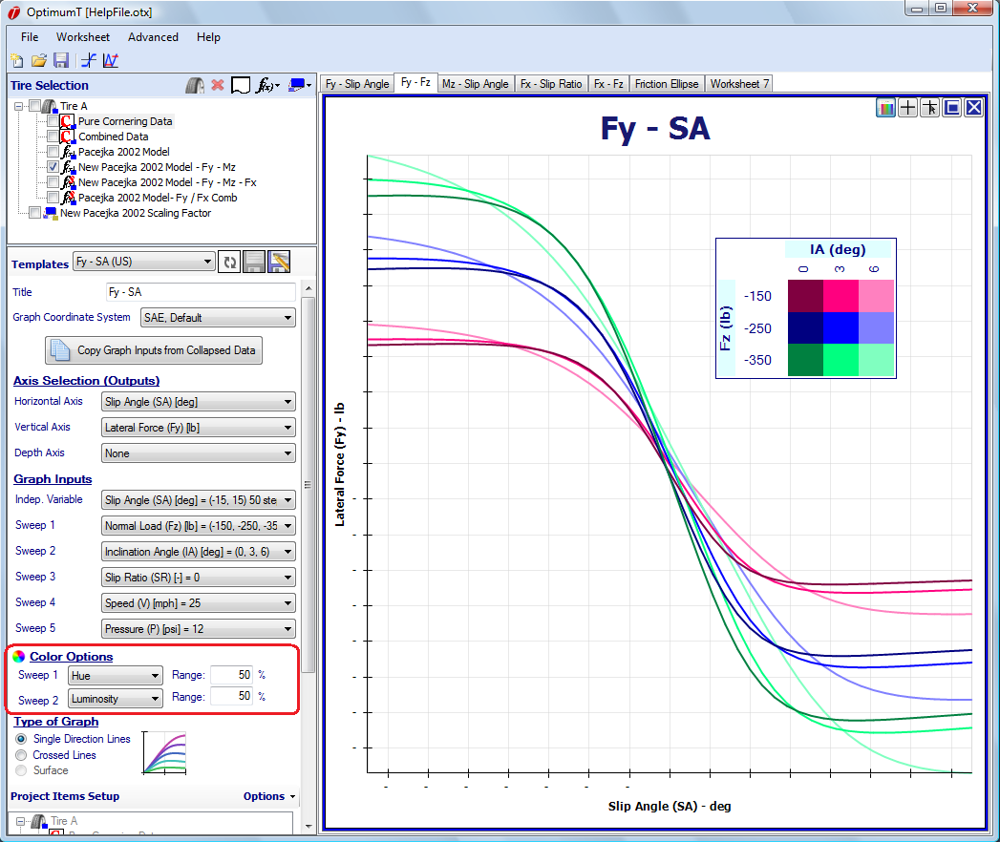

## Graph Templates

Graph templates allow the user to quickly display commonly used graphs. They can be accessed at the top of the graph setup form as shown in the figure below. Graph templates in the predefined folder are supplied with OptimumTire. These templates cannot directly be modified but can be changed and saved as new templates. They also can be copied into the user folder in the template manager.

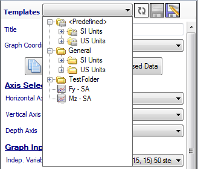

To load a graph template, select it from the list and click the __Load Graph Template__ button (which will be spinning after you choose a template). To save a new template, click on the __Save-As__ button next to the graph template list. Clicking the __Save__ button when a graph template is selected will overwrite the selected graph template.
