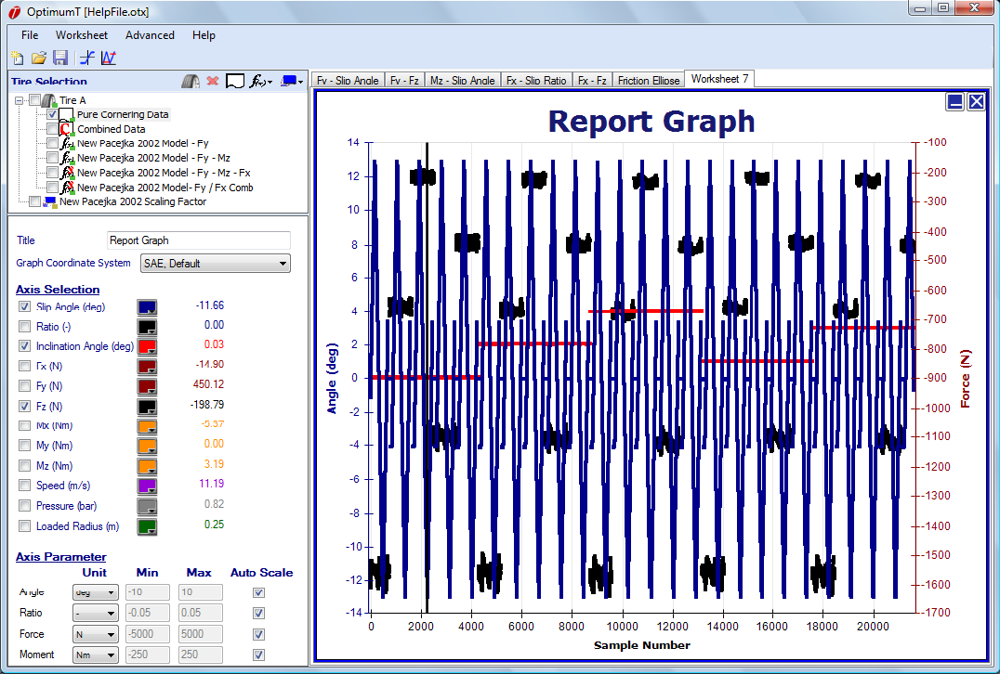

# Report Graphs

Report graphs display data versus sample number (which is proportional to time). Only raw tire data can be shown on report graphs. An example of a report graph is shown in the figure below. This is the same type of graph that is used in the data cropping tool. When this graph is selected a report graph setup form will appear in the data entry area. At the top of the form a title can be added to the graph and the coordinate system that the data will be displayed in can be changed. The quantities to be graphed (i.e. slip angle) can be selected from the checkboxes in this form. Multiple quantities can be graphed at the same time. At the bottom of the form the user can set the axis parameters including the minimum and maximum range (or Auto Scale) and the display units.

By clicking on the graph, the data cursor (vertical black line) can be moved. The data values to the right of the graph quantities in the setup form represent the values of the data at thedata cursor location. The graph can be zoomed in and out with the middle mouse button. While holding down the middle mouse button, draw a box from the top left to the bottom right corner of the area you want to zoom in on. Drawing a box in the opposite direction will un-zoom the graph. Right clicking on the mouse gives the user options to copy or print the graph as well add additional graphs or worksheets to the project.
