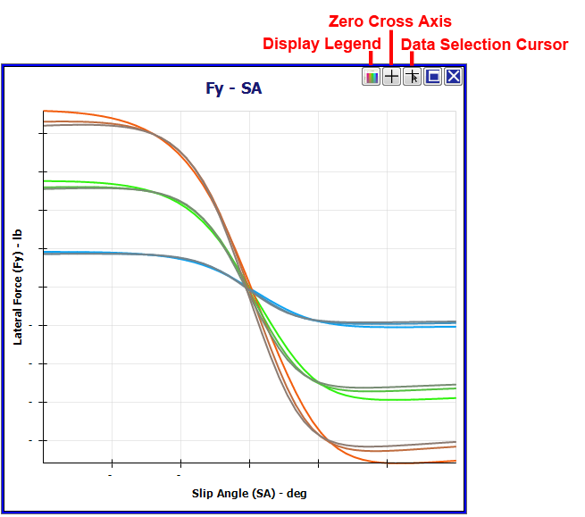
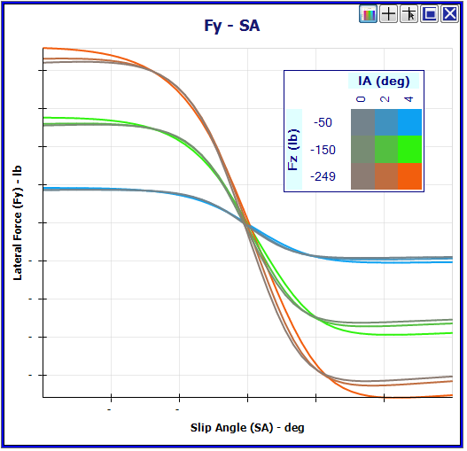
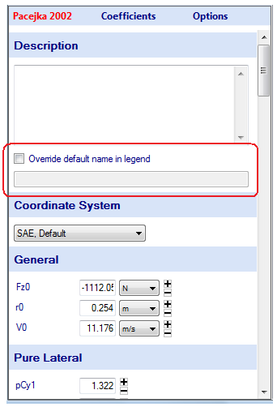
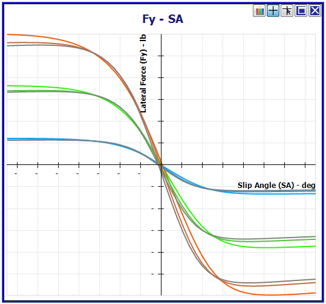
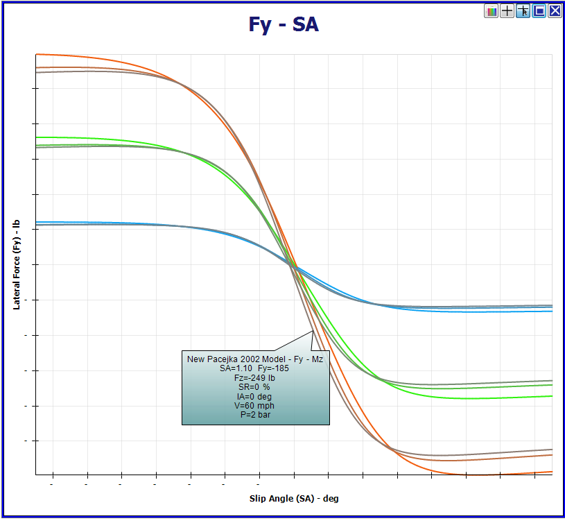
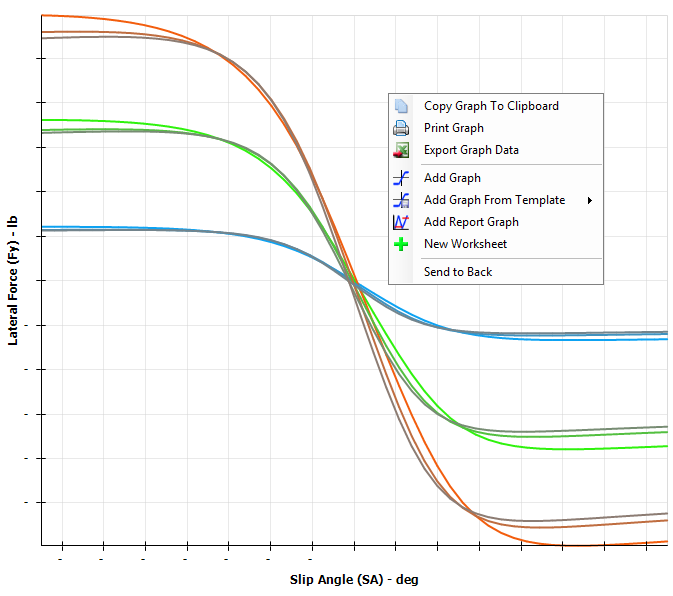
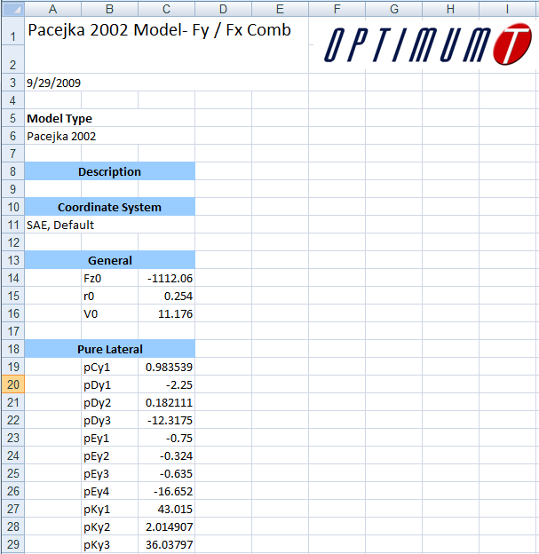

# Graph Area Options

In the upper right corner of each standard graph there are buttons that allow the user to access additional graphing options. These buttons are shown in the figure below. The two buttons on the far right are similar to typical windows buttons. The one on the far right will permanently close the graph and the other one will minimize or maximize the graph depending on its current state. The other three buttons are custom options in OptimumTire. These will first be discussed in detail in this section and then other graph options that can be accessed by right clicking on the graph will be covered.

## Display Legend

The __Display Legend__ button on the far left allows the user to show the graph legend. Clicking on this button will display the legend as shown below in the figure below. The legend can be moved by holding down the mouse button on it and dragging it to the desired location. It can also be resized by holding the mouse button down on the corners of the legend and dragging it to the desired size.

In the figure above, the legend displays the values and colors corresponding to the inputs in __Sweep 1__ and __Sweep 2__ in the graph setup form. Since both inputs were set as sweeps both are displayed in the legend. If neither or only one of the first two graph inputs include multiple values, the legend will display the names of the items in the project tree that are being graphed.

The names displayed in the legend can also be modified in the data entry area corresponding to the selected Item. Therefore, to change the legend name without renaming the item, click on the item in the project tree. Then the form shown in the figure below will appear in the data entry area. Selecting or deselecting the checkbox labeled Override the default name in legend will change the name of the item shown in the legend. When it is checked whatever text is entered into the textbox below the checkbox will appear in the legend instead of the name of the item.

## Axis Zero Cross

The __Axis Zero Cross__ button is the second button from the left. By default the graph axis will be displayed at the borders of the graph. When this button is selected the axis will be displayed on the gridlines corresponding to the zero value of the graph outputs. This is shown in the figure below.

## Data Selection Cursor

The __Data Selection Cursor__ allows the user to easily and quickly get information about a specific data point or line. An example of this is shown in the figure below. After clicking on the __Data Selection Cursor__ button, click on either a data line or point in the graph to see the test conditions and values corresponding to that specific location.

## Copy and Print Graphs

Graphs can be easily copied or printed from OptimumTire. These options are available through right clicking on either a standard or report graph as shown in the figure below. If __Copy Graph to Clipboard__ is selected than an image of the current graph will be copied to the windows clipboard. The user can then paste this image into other programs. If __Print Graph__ is selected the standard printing options window will open allowing the user to select the printer and set the printing preferences. When printed the graph will be automatically resized and centered to fit on a standard 8.5" x 11" piece of paper.

## Export Graph Data

Another feature shown in the figure above is the __Export Graph Data__. When this is selected the data that is currently plotted will be exported and saved to an Excel file. The different data sweeps will be separated by different headers indicating the conditions that they represent. An example of this is shown in the figure below.

