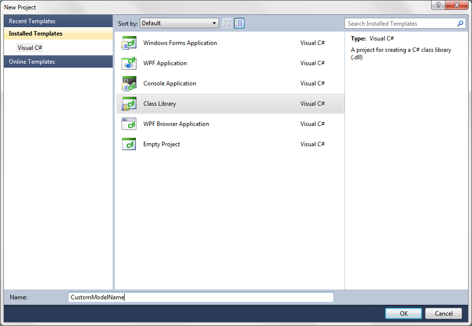
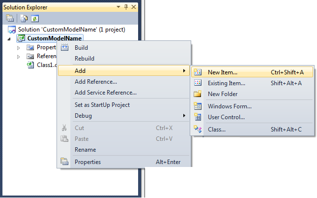
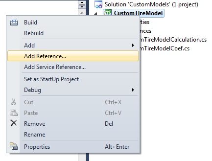
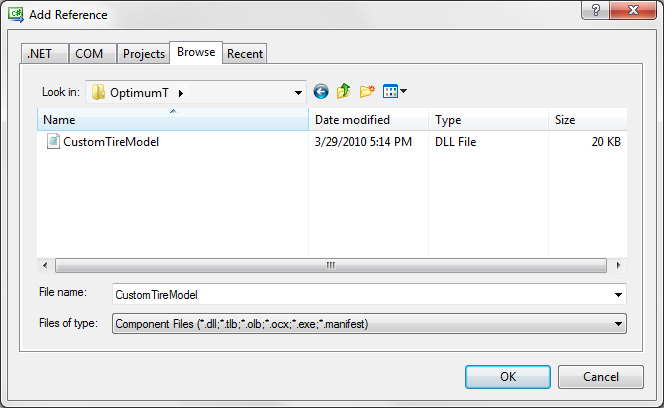
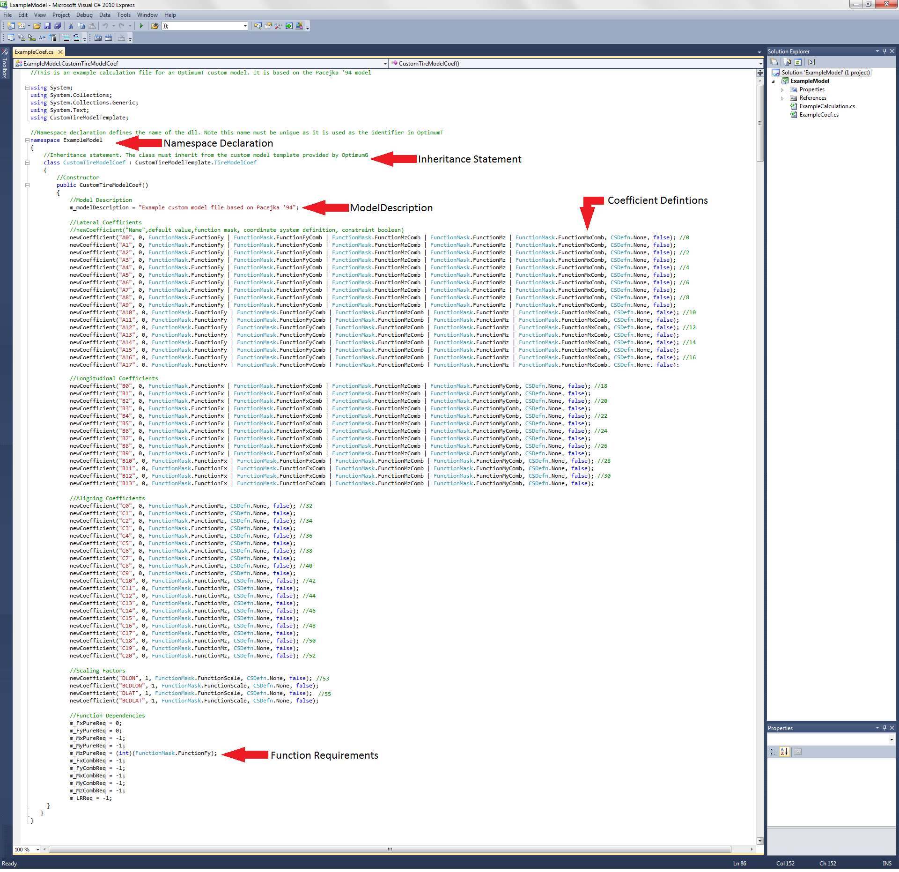
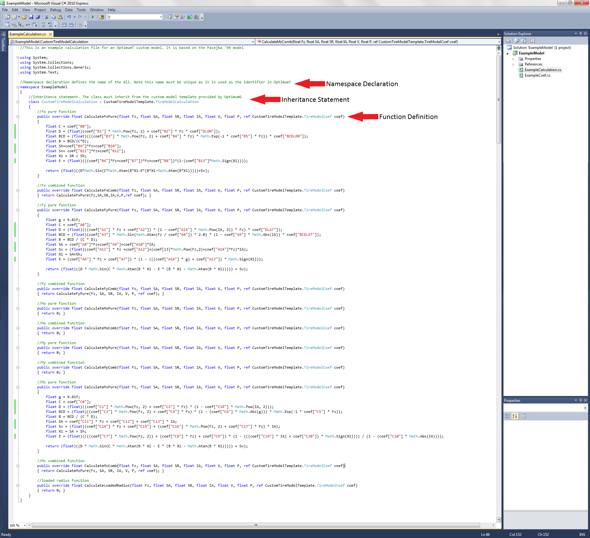

# Creating Custom Models

Custom models are based on a template written in C# this template is provided by OptimumG with the purchase of the custom models package. To create a new model the user must first define a .dll (dynamically linked library) file which can then be loaded into OptimumTire.

This file references the template provided by OptimumG so it must follow a certain syntax that makes it compatible with OptimumTire. This syntax is outlined in sections [Creating a Coefficient File](#creating-a-coefficient-file) and [Creating a Calculation File](#creating-a-calculation-file). The user .dll contains a list of coefficients and equations that define the user’s custom model.

An example project is included with OptimumTire to provide an example that users can copy and edit when developing custom models. The project is installed in My Documents on the users machine and can be opened with Visual C#.

## Software Requirements

The custom model template is written in Visual C# a CLI (Common Language Infrastructure) language. In order to create a custom model the user must first download a version of Visual C# by Microsoft. This software is available as a free Express Edition for the general user or Visual Studio Professional Edition for professional software developers. For the purposes of creating OptimumTire custom models the Visual C# Express Edition is sufficient. The download is available at the following site: [www.microsoft.com/express/Downloads](www.microsoft.com/express/Downloads).

OptimumTire requires two files: a __Coefficient File__ and a __Calculation File__ to define a model. The following sections outline how to create these files.

## Creating the Custm Model Project

The first step in creating custom model is to create a new C# project with the coefficient and calculation classes. To do this open Visual Studio or Visual C#. Create a new model from the file menu, select C# Class Library and enter the name of your model as shown.

Alternatively, you can open the example project provided with OptimumTire, modify it and save it under a different name.

Next, right-click on the project just created and select __Add__ -> __New Item__ to add a class to the project.

Add two classes, the coefficient class and the calculation class. Name these classes CustomTireModelCoef and CustomTireModelCalculation. Save the project and then continue with the following steps.

## Referencing the Custom Model Template

Once the project has been created the next step is to add the reference for the custom model template. Without this reference the custom model classes defined by the user cannot inherit from the template. To add a reference to a project first right-click on the C# project and select add reference from the dropdown menu as shown in the figure below.

Select the browse tab in the add reference dialog and browse to the OptimumTire installation folder. Select the CustomTireModelTemplate.dll and select OK as shown in the figure below. The reference to the template.dll should now appear in the project references folder in the Visual Studio Solution Explorer.

## Creating a Coefficient File

An example coefficient file has been included with the OptimumTire custom package. It is
shown in the figure below. It has a number of features.

The first section is the __Namespace Declaration__ this is the name of the custom .dll file and
will be used as an identifier within OptimumTire.

The second statement is the __Inheritance Statement.__ This is required to ensure all the template functions are available to the custom .dll. Without this statement the .dll will produce an error when loaded into OptimumTire. The coefficient file must inherit from the coefficient template CustomTireModelTemplate.TireModelCoef.

The third statement is the __Model Description__ which will appear in the description box on the model coefficient form sheet.

The fourth section contains the __Coefficient Definitions__ themselves. It is a list of the coefficients to be added to the array list. These statements are in the format shown at the start of this section.

The fifth section is the __Function Requirements__. These statements allow the user to change the function dependencies in the model. For example the aligning moment function often requires the the lateral force to be calculated frist. Therefore the function requirement for __CalculateMz__ will be __FunctionMask.FunctionFy__. The function requirements statements are
in the following syntax.

    m_MzPureReq = (int)(FunctionMask.FunctionFy);

setting a function requirement equal to -1 will make that function unavailable. Setting the requirement equal to 0 indicates that the function does not have any dependencies.

The coefficient file is simply an arraylist of coefficients. Each coefficient is defined in the following format:

    newCoefficient(("Name", Default Value, Function Mask, Coordinate System Definition, Constraint Boolean)

* __Name__: The name of the variable that will appear beside each variable in OptimumTire. Must be entered as a string enclosed in quotation marks "".
* __Default Value__: The default value of the coefficient that will apear when creating empty models, boundary files and constraints. This value is a single floating point number.
* __Function Mask__: Tells OptimumTire which outputs are related to each coefficient so the solver knows which coefficients to fit when fitting a specific model. OptimumTire has a list of function masks to choose from: 

``FunctionMask.FunctionFx``

``FunctionMask.FunctionFy``

``FunctionMask.FunctionFz``

``FunctionMask.FunctionMx``

``FunctionMask.FunctionMy``

``FunctionMask.FunctionMz``

``FunctionMask.FunctionRl``

``FunctionMask.FunctionScale``
 
Each coefficient must include one of these definition or a combination of the above separated by the or "| "operator. 
For example a coefficient "U" is used in the equations for calculating the lateral force, longitudinal force and aligning torque its coefficient mask is therefore: 

``FunctionMask.FunctionFx | FunctionMask.FunctionFy | FunctionMask.FunctionMz``
 
The function mask FunctionScale is used to specify that the coefficient is used as a scaling factor(see Section 3.3.2). This means the coefficient will not be fit in the fitting proccess and will remain the default value specified. The default value should be 1.0 in most cases for the scaling factors to have no effect on the model.

* __Coordinate System Definition__: The coordinate properties of the coefficient that determine which coordinate system conversion will cause the coefficient to change sign.
Each coordinate system definition is in the form CSDfn.X which means, that if the sign of the input X changes in a coordinate system conversion the coefficients with
the corresponding coordinate system definition will also change sign. OptimumTire provides the following coordinate system definitions: 

``CSDefn.V``

``CSDefn.SA``

``CSDefn.SR``

``CSDefn.IA``

``CSDefn.F _x``

``CSDefn.F _y``

``CSDefn.F _z``

``CSDefn.M _x``

``CSDefn.M _y``

``CSDefn.M _z``

``CSDefn.None``
 
Note: Leaving the coordinate system definition as CSDefn.None means the coefficient will not be affected by any coordinate system conversions within OptimumTire so the coefficients will always remain in the initially selected system. 
OptimumTire supports four coordinate systems these are the SAE, Adapted SAE, ISO and Adapted ISO coordinate systems. For definitions of these systems see Section 8.2.
These coordinate systems will apply the following coordinate system changes when converting from the default SAE coordinate system: 
__SAE__: Default 
__Adapted SAE__: CSDefn.SA | CSDefn.F_z 
__ISO__: CSDefn.SA | CSDefn.F_y | CSDefn.F_z | CSDefn.M_y | 
CSDefn.M_z 
__Adapted ISO__: CSDefn.IA | CSDefn.F_y | CSDefn.F_z | CSDefn.M_y | CSDefn.M_z

* __Constraint Boolean__: Defines whether a coefficient will be a fixed constraint or not. True if coefficient of fixed or false if it is a coefficient is to be fit.

## Creating a Calculation File

The calculation file contains the equations that define the tire model. An example of how to create a calculation file is included with the OptimumTire custom model package. The example is shown in the figure below.

The file contains several statements. The first is the __Namespace Declaration__, which is the name of the .dll and will be used by OptimumTire as an identifier for the custom model. It must be the same as the __Namespace Declaration__ in the coefficient file.

The second statement is the __Inheritance Statement__. This is required to ensure all the template functions are available to the custom .dll. Without this statement the .dll will produce an error when loaded into OptimumTire. The coefficient file must inherit from the calculation template ``CustomTireModelTemplate.TireModelCalculation``.

The third section contains the function definitons themselves. The primary functions must be declared in the following format to override the functions in the template file.

    public override float CalculateXXXXX(float Fz, float SA, float SR, float IA, float V, float P, ref CustomTireModelTemplate.TireModelCoef coef)

The custom calculation template contains the following overridable functions that can be redefined by the user.

``CalculateFxPure(Fz, SA, SR, IA, V, P, ref coef)``

``CalculateFxComb(Fz, SA, SR, IA, V, P, ref coef)``

``CalculateFyPure(Fz, SA, SR, IA, V, P, ref coef)``

``CalculateFyComb(Fz, SA, SR, IA, V, P, ref coef)``

``CalculateMxPure(Fz, SA, SR, IA, V, P, ref coef)``

``CalculateMxComb(Fz, SA, SR, IA, V, P, ref coef)``

``CalculateMyPure(Fz, SA, SR, IA, V, P, ref coef)``

``CalculateMyComb(Fz, SA, SR, IA, V, P, ref coef)``

``CalculateMzPure(Fz, SA, SR, IA, V, P, ref coef)``

``CalculateMzComb(Fz, SA, SR, IA, V, P, ref coef)``

``CalculateLoadedRadius(Fz, SA, SR, IA, V, P, ref coef)``

These functions define the primary outputs of OptimumTire. The user may include any number of additional functions that may be called from within these primary functions. It should be noted that the quality of the code in the calculation file will affect the speed of the fitting and graphing processes. Each function must follow the signature of the functions defined in the template file. Each function returns a single floating point value for the input values Fz, SA, SR, IA, V, P and the coefficient array.

When writing the functions themselves the user can refer to the coefficients by their name as previously defined in the coefficient file. eg. coef["A0 "].

## Common Programming Errors

The following are common errors made when programming in C#. Check the following basic syntax before compiling your custom .dll.

* In C# each command should be placed on a new line which ends with the ";"character.
* Functions, classes, loops and conditional statements are defined by braces. Each
"{"must have a matching "}".
* Each function must have the correct signature. Use intellisense to make sure that each
function passes all the required parameters.

For more information on programming in C# see [www.msdn.com](www.msdn.com).
