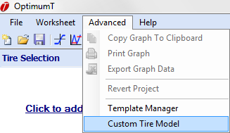
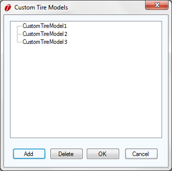

# Importing Custom Models in OptimumTire

Once the user has created or been given a custom model .dll file it can be loaded into OptimumTire. To load the custom model, select the __Advanced__ menu item in OptimumTire then select the __Custom Tire Model__ item from the dropdown menu as shown in the figure below.

Selecting the __Custom Tire Model__ item will launch the __Custom Tire Model Manager__ shown in the figure below.

The __Custom Tire Model Manager__ shows the list of custom models currently available in OptimumTire. The user can add or delete models from the list using the add and delete buttons. Note that OptimumTire uses the name of the .dll as an identifier so two custom models cannot be added with the same name. See [Creating a Coefficient File](../6_Custom_Models/A_Creating_Custom_Models#Creating-a-Coefficient-File) and [Creating a Calculation File](../6_Custom_Models/A_Creating_Custom_Models#Creating-a-Calculation-File) for how to name custom models.

Clicking on the __Add__ button opens a standard windows dialog. Navigate to the location of the custom .dll that is to be added and click __OK__ to add the model to the list.
