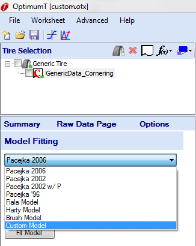
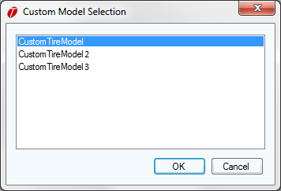

# The Custom Models Fitting Process

To fit a custom model the user can follow the same process used for standard model fitting. The __Custom Model__ option should appear at the bottom of the list of models available to fit in the model fitting dropdown menu as shown in the figure below.

Selecting the __Custom Model__ item from the dropdown will bring up the __Custom Model Selection Dialog__ shown in the figure below. Select the custom model to be fit by either double clicking on it, or selecting it and clicking the __OK__ button. This will launch the fitting process.

The main differences in the custom fitting process are the constraints and boundary files. Which coefficients appear in the __Constraints Wizard__ will depend on the __Constraint Boolean__ specified in the coefficient file created by the user (see [Creating a Coefficient File](../6_Custom_Models/A_Creating_Custom_Models.md#Creating-a-Coefficient-File)). Also the boundaries wizard will not contain predefined templates so a new boundary must be created for each new custom model.
