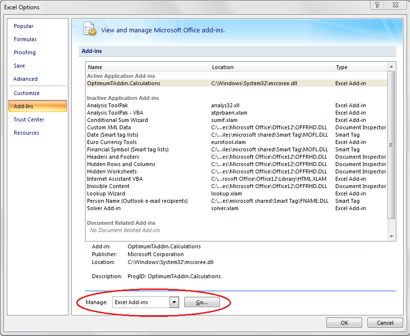
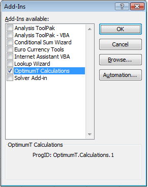
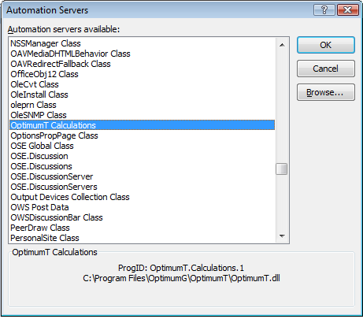
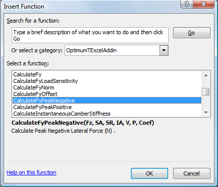
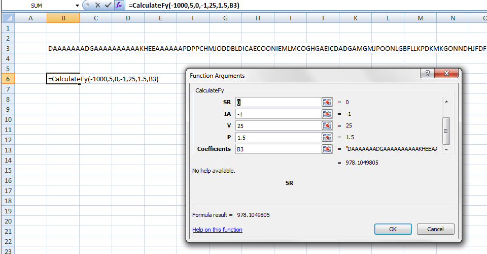
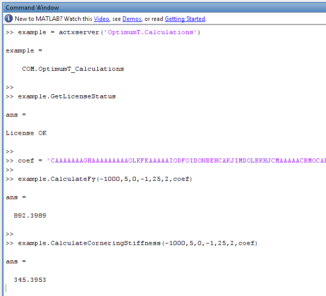
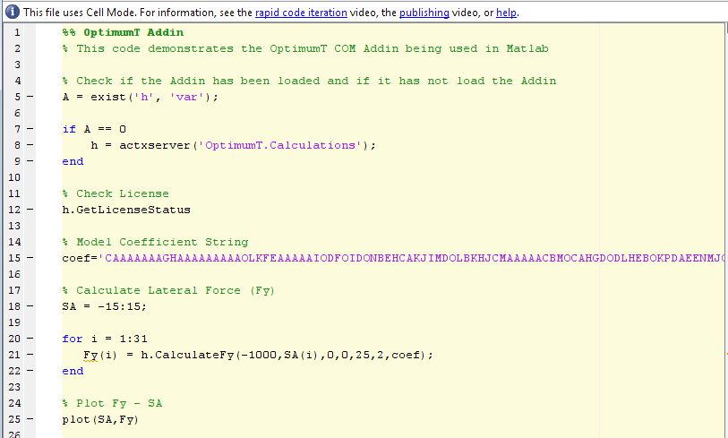

# OptimumTire Add-In

The OptimumTire add-in allows users to access all of the output quantities in OptimumTire from Excel, Matlab or any other software package that supports COM components. Simulations and calculations that require a tire model can be done easily using this feature. Look-up tables of the tire charactereistics can also be created quickly for use in other applications.

In the add-in, the model coefficients are specified to the OptimumTire functions with long character strings. These strings can be directly exported from OptimumTire. To do this first click on the desired tire model in the project tree. This will expose the model coefficients in the data entry area. Then click on the __Options__ button as shown in Figure 6.1. Then select __Export and Add-in Model to Clipboard__. This will copy the encoded string to the computer clipboard and allow it to be pasted into Excel or any other software.

The inputs and outputs of the add-in are expected to be in the coordinate system defined for
the model. The syntax used for the inputs of the functions is demonstrated in the following
equation.

``Output = Function(Fz, SA, SR, IA, V, P, ModelCoefficients)``

The coordinate system can be queried using the command:

``GetModelInfo(ModelCoefficients)``

The units used are also restricted. The units used are displayed in the table below. The values calculated are outputted in the same units as those in the table.

| Inputs | Unit |
|:---:|:---:|
|Normal Load (Fz)| newton|
|Inclination Angle (IA)| degree|
|Slip Angle (SA)| degree|
|Slip Ratio (SR)| ratio|
|Speed (V)| meter/sec|
|Pressure (P)| bar|

## Using the Add-In with Excel

The installation and use of the add-in in Excel 2007 will be demonstrated. Once OptimumTire is installed the Add-in can be accessed easily from Excel. First the user should click the __Start__ button in the top left corner of Excel. Then click the __Excel Options__ button as shown in the figure below.

Once the Excel options are open click on __Add-Ins__ at the left side of the window. In the dropdown box labeled __Manage__: select __Excel Add-ins__ (near the bottom of the window). This is shown in the figure below. Then, click on the __Go__ button.

The Add-ins selection window will now appear. In the figure below, __OptimumT.Calculations__ is shown in the list of add-ins. This add-in will have to be added to list by clicking on the button labeled Automation....

This will open the __Automation Server__ window as shown in
the figure below. Selecting __OptimumT.Calculations__ and pressing the __OK__ button will load the COM add-in into Excel. Now the add-in can be used in the same way as functions built into Excel.

Now the Add-in can be used in Excel by clicking on the __Insert Function__ button in Excel. This will open the window shown below in the figure below. The available functions will be displayed by selecting __OptimumTExcelAddin__ in the categories dropdown box.

Then the parameters of the function can be inputted as shown in the figure below. As can be seen, the input parameters are the six tire model inputs (normal load, slip angle, slip ratio, inclination angle, velocity and inflation pressure) and the tire model coefficients. 

The tire model coefficients are inputted as an encoded string as shown below.

## MATLAB COM Add-In

The use of the COM add-in in Matlab is demonstrated in this section. Every time that Matlab is opened the add-in needs to be loaded. The add-in is loaded in Matlab using the __actxserver__ function as shown below in the figure below. Then, all of the add-in functions can be accessed through the __handle.method__ syntax, were __handle__ is the variable that the add-in was loaded as and __method__ is the OptimumTire function that is to be used. In the figure below __example__ is the handle and __GetLicense__, __CalculateFy__ and __CalculateCorneringStiffness__ are all functions. To get the full list of the available functions just type __handle.Methods__ in the Matlab command window.

An example of the add-in being used in a m-file is shown in the figure below. In this example the handle variable (h in this case) is checked to see if it exists. If it does not exist then it loads the add-in. If it does already exist the add-in is not reloaded. This Matlab m-file is also included with OptimumTire. It is located in the Documents folder of the user who installed OptimumTire in a folder called __Matlab COM Addin__.

## Using the COM Add-In in Programs

The exact method for using the OptimumTire add-in with your own programs will depend on your programming environment. Please refer to the documentation that supplied with your programming environment for details on using COM components.

In most environments, you will need to add a reference to the OptimumTire type library. This is called ``OptimumT 1.0 Type Library`` or ``OptimumTLib``.

There is an example C# project provided with OptimumTire. It is located in the Documents folder of the user who installed OptimumTire in a folder called __OptimumTAddinExample__. The main function for this program is:

    static void Main(string[] args)
    {
        Console.WriteLine("Welcome to the OptimumTire Add-in example program\n\n");
        string modelCoef = "CAAAAAAAGHAAAAAAAAPELJFMGGGGGKODAAAAAKBEAJGPMLPDA" +
            "JJIEFPLNLHAAAODEGJIGBAMFAOJCLPLOLKEMCNLBODPFNNLKNOLOEODEF" +
            "BFFFBEJBLJCLPDHLONLLMDKFOAJHKDPGDCEELLNIHNCOMLODBJIJLLCMD" +
            "NJANDAKBPFDPLGJNNGIPLIMNKOJPDICBKMHPDEJDNMMNLGAODMDAMNELK" +
            "NMNDFJJCPJLDLNEJGILLNMHPLIBMDMNBAOBEOFBKBLPDLPFNCKILEHLCC" +
            "JKDNIBOCJIDBPNDMILDPDGNMABEDPBOJOAMMFEBCJPDOIFECOKDDMPDCO" +
            "MDCHNCOIOLKKJGMEBEFCJCBCBEMIMFMFLDFAGGKHPDMGNFBGMDMDANLHM" +
            "DKPIHEKKLABLCAEODKNGEIIAEJHMKKBAEBGKBANOLOHEJBDCMHFOFEJPL" +
            "KFAGCFMLAAAAAAAAAAAAAAAAAAAAAAAAAAAAAAAAAAAAAAAAAAAAAAAAA" +
            "AAAAAAAAAAAAAAAAAAAAAAAAAAAAAAAAAAAAAAAAAAAAAAAAAAAAAAAAA" +
            "AAAAAAAAAAAAAAAAAAAAAAAAAAAAAAAAAAAAAAAAAAAAAAAAAAAAAAAAA" +
            "AAAAAAAAAAAAAAAAAAAAAAAAAAAAAAAAAAAAAAAAAAAAAAAAAAAAAAAAA" +
            "AAAAAAAAAAAAAAAAAAAAAAAAAAAAAAAAAAAAAAAAAAAAAAAAAAAAAAAAA" +
            "AAAAAAAAAAAAAAAAAAAAAAAAAAAAAAAAIPDAAAAAIPDAAAAAIPDAAAAAA" +
            "AAAAAAAIPDAAAAAIPDAAAAAIPDAAAAAIPDAAAAAIPDAAAAAIPDAAAAAIP" +
            "DAAAAAIPDAAAAAIPDAAAAAIPDAAAAAIPDAAAAAIPDAAAAAIPDAAAAAIPD" +
            "AAAAAIPDAAAAAIPDAAAAAIPDAAAAAIPDAAAAAIPDAAAAAIPDAAAAAIPD";
        OptimumTLib.Calculations calc = new OptimumTLib.Calculations();
        // Display the type of model and the coordinate system
        Console.WriteLine("The model is:");
        Console.WriteLine(calc.GetModelInfo(modelCoef));
        // set up variables to plug into the tire model
        float Fz = -3000.0f; // the vertical load [N]
        float IA = 1.0f; // the inclination angle [deg]
        float SR = 0.0f; // the slip ratio [fraction]
        float V = 10; // the speed [m/s]
        float P = 2; // the inflation pressure [bar]
        // declare a variable to store the calculated lateral force in
        float Fy;
        Console.Write("\n\n SA Fy\n");
        // loop through a series of slip angles and display the resulting force
        for (float SA = -10.0f; SA <= 10.0f; SA+=2.0f)
        {
            Fy = calc.CalculateFy(Fz, SA, SR, IA, V, P, modelCoef);
            Console.WriteLine(string.Format("{0,5} {1,10}", SA, Fy)    );
        }
        Console.Write("\nPress any key to exit...");
        Console.ReadKey();
    }
