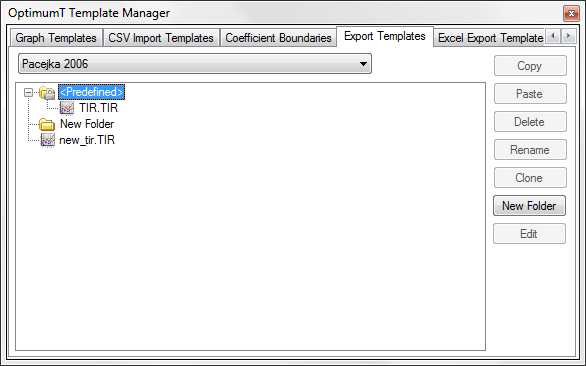

# Template Manager

The template manager allows the user to easily organize or delete templates in OptimumTire. The template manager can be accessed by clicking on Advanced in the main toolbar and then clicking on __Template Manager__. A window similar to that shown in the figure below will open. In this window the user can manage graph templates, CSV import templates, coefficient boundaries and model export templates by clicking on the associated tabs. As can be seen in the figure the coefficient boundaries are organized by the different models. The models can be chosen from the dropdown box above the list of templates top of the window.

The templates can be deleted, renamed, or cloned using the buttons on the right side of the __Template Manager__. New folders can also be created so that the templates can be easily organized. The templates that are contained in the __Predefined__ folder are included in OptimumTire and cannot be edited or deleted. However, they can be cloned. When they are cloned the copied version of the template will be moved outside of the __Predefined__ folder, so that it can be modified. The paste button allows the user to paste files from the clipboard into the appropriate folder which a useful feature when transfering large numbers of templates.
