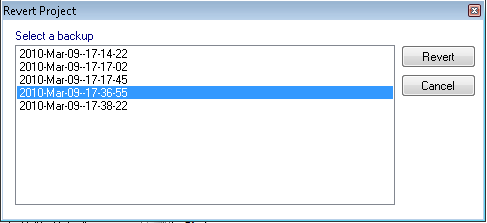

# Project Backups

OptimumTire saves a backup of the project before each save operation. This allows you to recover from a corrupted project or to recover if you accidentally made an unwanted change to the project and saved it. By default, the last five revisions of the project are stored.

To go to a previous version of the project, click on the __Advanced__ menu and then on __Revert Project__. You will then see the __Revert Project__ dialog (shown in th figure). Select the backup that you wish to revert to and click on Revert. The date and time shown in this dialog is the time at which that version was initially created.

When you revert a project, OptimumTire automatically creates a backup of the project immediately before reverting it. This allows you to "undo" a revert operation.

If a project fails to load, the __Revert Project__ dialog will automatically be shown. This allows you to recover your project from an earlier backup.
