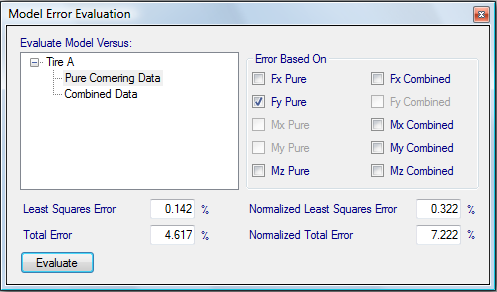

# Error Evaluation

The __Error Evaluation__ tool is shown in the figure below. This tool allows quick comparison of the error of the tire models against different sets of raw data. It also allows comparison between the four different types of error calculation. To access this tool first select the tire model for the error to be evaluate on in the project tree. At the top of the data entry form select __Options__ and then __Evaluate Error__.

Once the __Error Evaluation__ is open the data to be compared should first be selected in the list on the left. Then the models to base the error calculation should be selected. Clicking on the __Evaluate__ button at the bottom of the window will calculate and display the error each of the different error calculation methods.
