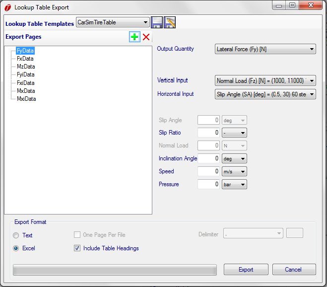

# Lookup Table Export

OptimumTire offers the possibility to export lookup tables. These tables are compatible with simulation products such as CarSim or other software that uses a lookup table for modelling tyre performance rather than directly importing model coefficients and equations. Lookup tables may be exported by selecting a model to export from the tree then clicking __Options__->__Export__->__Lookup Table__. This will bring up the lookup table export form shown below.

As an example, the figure below shows the form filled.

The form is split into three parts. The first is the __Page Tree__. Pages can be added to the export file by clicking the green __+__ sign and deleted by clicking the red __x__. Pages may also be renamed in the tree, these names will provide the basis for the file names when exporting text files, or the sheet names when exporting to Excel.

The second part of the form is the __Output__ Settings. Each page in the page tree has an individual output settings sheet which specifies the parameters of the look up table. The output dropdown specifies which OptimumTire output will be used to populate the table. The __Vertical__ and __Horizontal__ dropdowns allow you to specify the type, range and step of the vertical and horizontal axes. The remaining boxes specify the values of the outputs to be held constant in the table.

The third part of the table is the __Format__ section. This specifies the global format for the export. Files may be exported as an MS Excel workbook or as text file. Text files may export multiple pages in one file or export each page to an individual file by selecting the __one page per file__ radio button. When exporting files to excel a labels may be added to the tables to indicate the names of the table parameters. This is done by selecting the __Include Table Headings__ check box. The text file delimiter may be adjusted using the delimiter drop down or a custom delimiter may be used by typing a delimiter in the custom delimiter text box.

A useful feature of the lookup table export is the ability to save the settings in a template for repeated exports. The __Lookup Table Templates Bar__ is located at the top of the form. Templates may be applied using the dropdown menu or new templates saved using the save icons.
