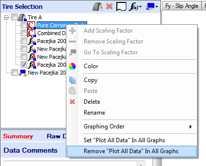
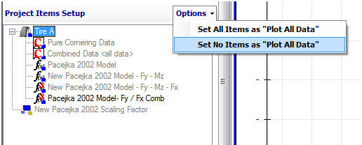

# Plot All Data

By default, when raw data is inputted into OptimumTire the __Plot All Data__ option is enabled. This option will cause all of the data to appear in graphs regardless of the graph input parameters. This allows the user to quickly view the data and check that it is correct before continuing. However, the color of the graphed data will not vary with the input parameters. Therefore, to look at only certain parts of the data or to have the data colored by the graphing parameters this option needs to be disabled.

There are three different ways to disable the __Plot All Data__ option. The first one is by right clicking on the raw data in the project tree and selecting __Remove "Plot All Data" In All Graphs__. This is shown in the figure below. This will disable the feature for the selected data set
in all of the graphs.

The other two procedures to disable this option are located in the __Project Items Setup__ at the bottom of the graph setup form as shown in the figure below. Since this is located in the graph setup form it will only affect the graph that it corresponds to. As can be seen __"\<all data\>"__ will appear to the right of the name of the data if __Plot All Data__ is enabled. By right clicking on the data and clicking on the __Plot All Data__ selects or unselects this feature. The __Options__ button in the upper right of the figure allows the user to set all or no items to __Plot All Data__.

