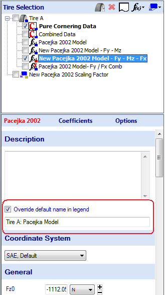
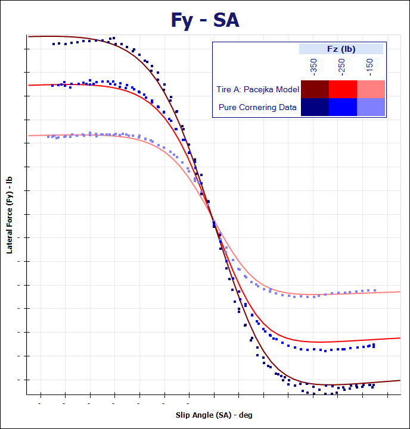

# Override Default Name In Legend

Often the name of an item (a tire model or raw data) will be too long to conveniently view in the legend. Therefore, you can easily display a custom name in the legend without having to change the name of the item. This is done by clicking on the item in the project tree that a custom name is to be given to. In the data entry area, the input form of the selected item will appear as shown in the figure below.

The custom legend name will be used if the checkbox labeled __Override default name in legend__ is checked. The custom name can be inputted into the textbox below the textbox below. The resulting graph with the custom legend name can be seen in the figure below.

