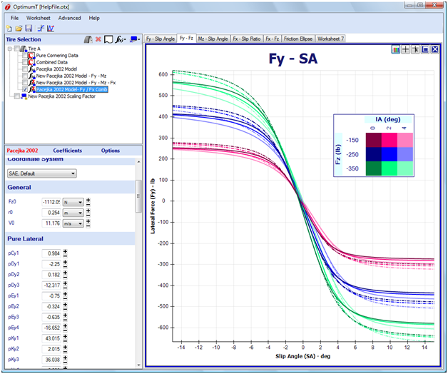

# Preview Model Coefficient Change

The values of the model coefficients can be changed by double clicking on the __+__ or __-__ button next to the coefficient. If the model is shown on a graph, holding down the __+__ or __-__ button will show a preview of the model with the coefficient modified by 10%. An example of this is shown in the figure below. In this figure the __+__ button of the __pDy1__ coefficient is being held down. This change can be made permanent by double clicking on this button.

