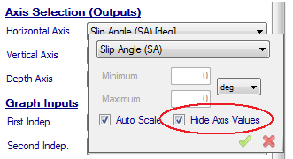

# Hide Axis Values

The user can choose whether to display axis values on the graphs. This can be very important to ensure confidentiality of the data. This option is available in the __Axis Selection__ drop down dialog boxes as shown in the figure below. If the __Hide Axis Values__ box is checked the numeric values on the specified graph axis will not be displayed.

