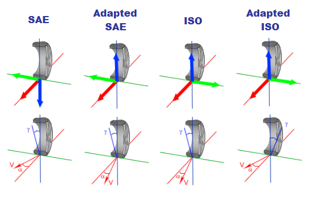

# Coordinate Systems

OptimumTire allows the user to select between four different coordinate systems:

* Society of Automotive Engineers (SAE) J670e.
* Adapted SAE.
* International Organization for Standardization (ISO).
* Adapted ISO.

The following figures shows the orientation of these coordinate systems and the graphs of typical tire parameters in the different coordinate systems.

